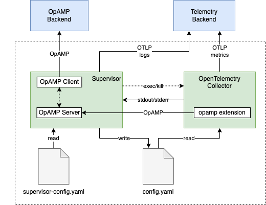
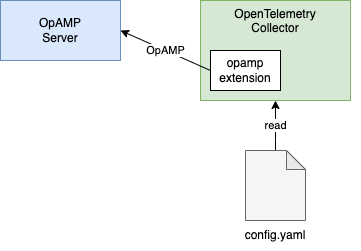

# OpAMP for OpenTelemetry Collector

Author: Tigran Najaryan

## Introduction

[OpAMP](https://github.com/open-telemetry/opamp-spec) has been one of
the most requested capabilities at Kubecon 2022. We can implement OpAMP
for the Collector in 2 different ways:

- As a Collector extension, with limited functionality,
- As an external Supervisor, that implements all or most of OpAMP
    capabilities.

In discussions with users and Collector contributors we found that both
of these approaches are wanted. This document describes how to implement
both while minimizing duplicate work.

The main idea is to implement a Collector extension with a limited set
of OpAMP capabilities, where the extension can be used on its own, then
additionally create an external Supervisor that uses the exact same
extension as a helper and implements the remaining OpAMP capabilities on
top of what the extension implements. This way most of OpAMP-related
functionality is implemented once only, there is virtually no code
duplication.

## Supervised Operation

This section describes a specialized Supervisor made for OpenTelemetry
Collector. The Supervisor will have the benefit of knowing for example
how to inject desirable values into the Collector's configuration file.

Here is how a Supervisor-based management works:



The Supervisor process does the following:

- Implements the client-side of OpAMP protocol and communicates with
    the OpAMP Backend.
- Starts/stops the Collector process as necessary.
- Receives configuration from the OpAMP Backend and pushes it to the
    Collector, using the Collector config.yaml file as an intermediary,
    restarting the Collector process as necessary.
- Serves as a watchdog, restarts the Collector process if the
    Collector crashes.
- Accepts an OpAMP connection from Collectors' [*opamp
    extension*](#collectors-opamp-extension), receives the Collector's
    AgentDescription, HealthStatus and EffectiveConfig messages and
    forwards them to the OpAMP Backend.
- Optionally: downloads Collector executable packages offered by the
    Backend and performs the Collector updates.
- Optionally: configures Collector to collect Collector's own metrics
    and report the metrics to the OTLP telemetry backend requested by
    OpAMP Backend.
- Optionally: collects Collector logs and sends them to the Telemetry
    Backend via OTLP.

Supervisor is implemented as a Go library that may be customized and
rebuilt by vendors with useful default configurations, such as the OpAMP
Backend endpoint to connect to, in order to minimize the manual
configuration required.

*Important: the Supervisor needs to be highly stable, so we need to keep
its complexity and functionality to minimum. The features listed in this
section need a critical review and may be removed (responsibility moved
elsewhere, e.g. to the Collector itself).*

### Supervisor Configuration

The Supervisor is configured via a yaml config file:

```yaml
# OpAMP backend server settings.
server:
  # endpoint is a URL and is mandatory.
  # ws,wss,http,https schemes are supported.
  # Other connection settings, e.g. TLS cert, etc.
  endpoint: wss://example.com/opamp

# Keys with boolean true/false values that enable a particular
# OpAMP capability.
capabilities:
  # The Supervisor will accept remote configuration from the Server.
  accepts_remote_config: # false if unspecified

  # The Supervisor will accept restart requests.
  accepts_restart_command: # false if unspecified

  # The Supervisor will accept connections settings for OpAMP from the Server.
  accepts_opamp_connection_settings: # false if unspecified

  # The Supervisor will report EffectiveConfig to the Server.
  reports_effective_config: # true if unspecified

  # The Collector will report own metrics to the destination specified by
  # the Server.
  reports_own_metrics: # true if unspecified

  # The Collector will report own logs to the destination specified by
  # the Server.
  reports_own_logs: # false if unspecified

  # The Collector will report own traces to the destination specified by
  # the Server.
  reports_own_traces: # false if unspecified

  # The Collector will report Health.
  reports_health: # true if unspecified

  # The Supervisor will report remote config status to the Server.
  reports_remote_config: # false if unspecified

  # The Supervisor will report available Collector components to the Server.
  reports_available_components: # false if unspecified

  # The Supervisor will report OpAMP heartbeats to the Server.
  reports_heartbeat: # true if unspecified

storage:
  # A writable directory where the Supervisor can store data
  # (e.g. cached remote config).
  # defaults to /var/lib/otelcol/supervisor on posix systems
  # and %ProgramData%/Otelcol/Supervisor on Windows.
  directory: /path/to/dir

agent:
  # Path to Collector executable. Required.
  executable: /opt/otelcol/bin/otelcol

  # The interval on which the Collector checks to see if it's been orphaned.
  orphan_detection_interval: 5s

  # The maximum wait duration for retrieving bootstrapping information from the agent
  bootstrap_timeout: 3s

  # Extra command line flags to pass to the Collector executable.
  args:

  # Extra environment variables to set when executing the Collector.
  env:

  # Optional user name to drop the privileges to when running the
  # Collector process.
  run_as: myuser
  # List of configuration files to be merged to build the Collector's effective
  # configuration. It includes a few "special" files. Read the "Config Files" section
  # below for more details.
  config_files:
    - $OPAMP_EXTENSION_CONFIG
    - $OWN_TELEMETRY_CONFIG
    - $REMOTE_CONFIG

  # Optional directories that are allowed to be read/written by the
  # Collector.
  # If unspecified then NO access to the filesystem is allowed.
  access_dirs:
    read:
      allow: \[/var/log\]
      deny: \[/var/log/secret_logs\]
    write:
      allow: \[/var/otelcol\]

  # Optional key-value pairs to add to either the identifying attributes or
  # non-identifying attributes of the agent description sent to the OpAMP server.
  # Values here override the values in the agent description retrieved from the collector's
  # OpAMP extension (self-reported by the Collector).
  description:
    identifying_attributes:
      client.id: "01HWWSK84BMT7J45663MBJMTPJ"
    non_identifying_attributes:
      custom.attribute: "custom-value"

  # The port the Supervisor will start its OpAmp server on and the Collector's
  # OpAmp extension will connect to
  opamp_server_port:

# Supervisor's internal telemetry settings.
telemetry:
  # Logs configuration.
  logs:
    # Minimum enabled logging level.
    # Defaults to info.
    level: debug
    # URLs or file paths to write logging output to.
    # Defaults to stderr.
    output_paths:
      - stderr
      - supervisor.log
    # Log processors to emit logs.
    processors:
      - batch:
          exporter:
            otlp:
              protocol: http/protobuf
              endpoint: https://backend:4318
  # Metrics configuration.
  metrics:
    # Verbosity of the metrics output.
    level: detailed
    # Metric readers to emit metrics.
    readers:
      - periodic:
          exporter:
            otlp:
              protocol: http/protobuf
              endpoint: https://backend:4318
  # Traces configuration.
  traces:
    # Verbosity of the spans emitted.
    level: detailed
    # Enabled context propagators.
    propagators:
      - tracecontext
    # Span processors to emit spans.
    processors:
      - batch:
          exporter:
            otlp:
              protocol: http/protobuf
              endpoint: https://backend:4318
  # Resource attributes.
  resource:
    service.namespace: otel-demo

```

#### Notes on `agent::config_files`, `agent::args`, and `agent::env`

Please be aware that when using the `agent::config_files` parameter,
the configuration files specified are applied in the order they are specified.
In other words, configuration files are merged from the top of the list to the bottom.
Configuration added by files at the top of the list may be overwritten by the later ones.

The indicated configuration files are merged in memory and the resulting configuration
is written to `<storage::directory>/effective.yaml`.

There are a few "special" configuration files that can be used to completely
customize final configuration given to the Collector. Below are the available
values and what they represent:

- `$OPAMP_EXTENSION_CONFIG`: configuration for the OpAMP extension to connect to the Supervisor.
- `$OWN_TELEMETRY_CONFIG`: configuration for the agent to report its own telemetry.
- `$REMOTE_CONFIG`: remote configuration received by the Supervisor.

**NOTE**: These configuration snippets, particularly `$OPAMP_EXTENSION_CONFIG`, are essential for the Supervisor and Collector to work together. Overriding values in these may result in the Supervisor failing to properly start the Collector and should be done with caution.

These special files can be mixed with user-provided configuration files to create complex
configuration merge orders, for instance, creating base-layer configuration at the
lowest priority while keeping compliance configuration at the highest priority:

```yaml
agent:
  config_files:
    - base_config.yaml
    - $OWN_TELEMETRY_CONFIG
    - $OPAMP_EXTENSION_CONFIG
    - $REMOTE_CONFIG
    - compliance_config.yaml
```

If **one or more** of the special files are not specified, they are automatically
added at predetermined positions in the list. The order is as follows:

- `$OWN_TELEMETRY_CONFIG`
- <USER_PROVIDED_CONFIG_FILES>
- `$OPAMP_EXTENSION_CONFIG`
- `$REMOTE_CONFIG`

Arguments present in `agent::args` are passed to the executable binary **after** the configuration files.
The environment variables specified in `agent::env` are set in the Collector process environment.

Take the configuration below as an example:

```yaml
agent:
  executable: ./otel-binary
  config_files:
    - './custom-config.yaml'
    - './another-custom-config.yaml'
  args:
    - '--feature-gates'
    - 'service.AllowNoPipelines'
  env:
    HOME: '/dev/home'
    GO_HOME: '~/go'
```

This results in the following Collector process invocation:

```shell
./otel-binary --config /var/lib/otelcol/supervisor/effective.yaml --feature-gates service.AllowNoPipelines
```

### Operation When OpAMP Server is Unavailable

When the supervisor cannot connect to the OpAMP server, the collector will
be run with the last known configuration if a previous configuration is persisted.
If no previous configuration has been persisted, the collector does not run.
The supervisor will continually attempt to reconnect to the OpAMP server with exponential backoff.

### Executing Collector

The Supervisor starts and stops the Collector process as necessary. When
run_as setting is provided, the Supervisor will execute the Collector
process as the specified user. This is highly recommended in situations
when the Supervisor itself is running as root and it is desirable to
drop the root privileges and run the Collector as a more restricted
user.

#### Stopping Collector

To stop the Collector the Supervisor will issue a SIGTERM signal first,
wait for the process to exit, then force exit via SIGKILL if necessary.

### Collector Config

The Supervisor creates a Collector config file in a temp directory and
passes to the Collector via --config command line option. The config
file is created by merging the local config file (optional) and the
remote config received from OpAMP backend (also optional). The
configuration file merging rules match the merging rules that are
already in place in the Collector codebase (key-by-key, recursively).

#### Remote Configuration

Note: this capability must be manually enabled by the user via a
AcceptsRemoteConfig setting in the supervisor config file and is
disabled by default.

The Supervisor receives [*Remote
Configuration*](https://github.com/open-telemetry/opamp-spec/blob/main/specification.md#configuration)
from the OpAMP Backend, merges it with an optional local config file and
writes it to the Collector's config file, then restarts the Collector.

If the remote configuration from the OpAMP Backend contains an empty config map,
the collector will be stopped and will not be run again until a non-empty config map
is received from the OpAMP Backend.

In the future once config file watching is implemented the Collector can
reload the config without the need for the Supervisor to restart the
Collector process.

The Supervisor will report to the OpAMP Backend the status of all these
operations via RemoteConfigStatus message.

#### Sanitizing Configuration

The Supervisor will sanitize the configuration of the components that
access the local filesystem according to the access_dirs config setting
to only allow specified directories and their subdirectories. This
applies for example to \`include\` setting of the \`filelog\` receiver
or to \`directory\` setting of the \`file_storage\` extension.

The Supervisor will locate all such entries while building the Collector
config file and will delete the ones which are prohibited by the access
control settings.

*Open Question: if after sanitizing the component's directory setting
the configuration becomes invalid what do we do?*

*The sanitizing logic is hard-coded in the Supervisor and works for
specific components only. In the future we will consider implementing a
more generic safety mechanism that does not depend on the knowledge
about specific component behavior.*

#### Bootstrapping

In order to obtain the remote configuration from the OpAMP Backend the
Supervisor must send an AgentDescription to the Backend. Initially the
Supervisor doesn't have this information. The AgentDescription becomes
available only after the Collector process is started and the
AgentDescription is sent from the opamp extension to the Supervisor.
However, it is impossible to start the Collector without a
configuration.

To overcome this problem the Supervisor starts the Collector with an
"noop" configuration that collects nothing but allows the opamp
extension to be started. The "noop" configuration is a single pipeline
with an nop receiver, a nop exporter, and the opamp extension.
The purpose of the "noop" configuration is to make sure the Collector starts
and the opamp extension communicates with the Supervisor. The Collector is stopped
after the AgentDescription is received from the Collector.

Once the initial Collector launch is successful and the remote
configuration is received by the Supervisor the Supervisor starts the
Collector with the new config. The new config is also cached by the
Supervisor in a local file, so that subsequent restarts no longer need
to start the Collector using the "noop" configuration. Caching of the
last config also allows the Supervisor to subsequently start the
Collector without waiting for the OpAMP Backend to provide the remote
config and mitigates OpAMP Backend unavailability.

#### Reverting

One of the challenges when the Supervisor updates the configuration is
knowing whether the configuration is successfully applied or not. There
may not exist a definite signal that indicates that all of the
configuration is good and applied by the Collector. One possible
approach is to set a certain period after which the Collector is
expected to be up and running in "healthy" status and if that does not
happen (i.e. the Collector crashes or "healthy" status is not seen) then
the configuration is reverted to the last one.

The reverting likely needs to be an optional feature that the user can
enable. TODO: add a Supervisor config setting for this option.

### Watchdog

The Supervisor will monitor the Collector process it started. If the
Collector process terminates unexpectedly the Supervisor will restart
the Collector (with a backoff). The Supervisor can also report restart
or crash-related metrics along with other telemetry it reports for the
Collector.

### Collector Instance UID

The Supervisor maintains a Collector instance_uid (a
[UUIDv7](https://www.rfc-editor.org/rfc/rfc9562#section-5.7)).
The instance_uid is generated by the Supervisor on the first run or
during the Supervisor installation and remains unchanged thereafter. The
instance_uid will be used in OpAMP communication.

The value is injected into the Collector config in [opamp
extension's](#collectors-opamp-extension) instance_uid setting and as
service.instance.id attribute under the service.telemetry.resource
setting.

Note: if [Make generated service.instance.id available to
extensions](https://github.com/open-telemetry/opentelemetry-collector/issues/6599)
is implemented then the instance_uid setting in the opamp extension is
no longer necessary.

### Collector's Own Telemetry

#### Own Metrics

Supervisor will configure Collector to report its own metrics to the
OTLP destination requested by the OpAMP Backend. See how it is done in
[this example
here](https://github.com/open-telemetry/opamp-go/blob/efddaa260895e7ebb2431deeefef3a3380d8d902/internal/examples/supervisor/supervisor/supervisor.go#L277).

Eventually, when the Collector's internal metrics are migrated to Otel
SDK we should be able to configure the SDK to send to this destination
without configuring a Collector pipeline.

#### Own Logs

The Supervisor will collect Collector's logs (the stdout and stderr) and
send them to the log collection endpoint offered by the OpAMP Backend.

The Supervisor will configure the Collector output logs in json format
(e.g. [like
this](https://github.com/open-telemetry/opamp-go/blob/efddaa260895e7ebb2431deeefef3a3380d8d902/internal/examples/supervisor/supervisor/supervisor.go#LL220C21-L220C21))
and will parse them, then send to the OTLP destination requested by the
OpAMP Backend. The Supervisor will enrich the logs using the attributes
it received previously in AgentDescription message from the [opamp
extension](#collectors-opamp-extension).

Note that for logs we are not using the same approach as we do for
Collector's own metrics. The reason is that collecting logs may produce
logs and that may result in catastrophic amplification of generated
logs. To safeguard from that we collect logs using the Supervisor.

The additional benefit of using Supervisor for log collection is that if
the Collector crashes the Supervisor will still be able to collect all
log output up until the process termination, which can be crucial for
understanding the cause of crash (using Collector to collect its logs
won't guarantee this).

The Supervisor will also write the Collector's log to a local log file.
The path to the Collector log files will be printed in the Supervisor
output.

*Open Question: instead of writing to a local log file do we want to
pipe Collector logs to Supervisor's log output?*

### Collector Executable Updates

Note: this capability must be manually enabled by the user via the
AcceptsPackages setting in the supervisor config file and is disabled by
default.

This capability should be only implemented after we introduce the code
signing process for the Collector and all released Collector executables
are signed, the Supervisor is capable of verifying the signature of
executables and other OpAMP security recommendations are followed.

The Supervisor will download Collector package updates when offered so
by the Backend. The Supervisor will verify the integrity of the packages
and will install them. This requires stopping the Collector, overwriting
the Collector executable file with the newly downloaded version and
starting the Collector. Before overwriting the executable the Supervisor
will save it in case it is necessary for reverting.

If after the restart the Collector does not become healthy the
Supervisor will revert the update, by stopping the Collector, reverting
the Collector executable file and starting the Collector again. The
failed update attempt will be reported to the Backend and the failed
Collector package version will be marked as "bad" to avoid trying it
again even if offered by the Backend.

Note: cached local config must be invalidated after executable updates
to make sure a fresh AgentDescription is obtained by the Supervisor on
the next Collector start (at the minimum the version number to be
included in AgentDescription is expected to change after the executable
is updated).

### OpAMP Heartbeats

OpAMP heartbeats are enabled by default in the Supervisor. They can be
disabled by setting `capabilities.reports_heartbeat` to `false`. The
default interval is 30 seconds, but this can be changed by the OpAMP
server sending a ServerToAgent message with the appropriate field set.
This causes the Supervisor to periodically send an empty OpAMP
AgentToServer message in order to keep the connection alive.
For more information see the [OpAMP specification](https://github.com/open-telemetry/opamp-spec/blob/main/specification.md#opampconnectionsettingsheartbeat_interval_seconds).

### Addons Management

The Collector currently does not have a concept of addons so this OpAMP
capability is not implemented by the Supervisor.

### Exporter Connection Settings

The Supervisor will populate the connection settings for exporters in
the Collector configuration file based on the "other_connections" named
settings it receives from the OpAMP Backend. Each named connection
setting corresponds to the exporter with the same name. The Supervisor
will populate exporter settings from OpAMP ConnectionSettings message
the following way:

| **ConnectionSettings**    | **Exporter setting** |
| ------------------------- | -------------------- |
| destination_endpoint      | endpoint             |
| headers                   | headers              |
| certificate.public_key    | tls.cert_file        |
| certificate.private_key   | tls.key_file         |
| certificate.ca_public_key | tls.ca_file          |

The received certificate will be written to local files and the paths to
the files containing the keys will be populated in the corresponding
sections under the \`tls\` setting.

## Collector's opamp Extension

The Supervisor automatically injects the opamp extension in the
Collector's configuration. The opamp extension implements an OpAMP
client with a small subset of OpAMP agent capabilities:

- ReportsStatus. The extension reports agent description and status.
    This is the first message from the client to the server in the OpAMP
    protocol that is essential for beginning OpAMP message exchange.
- ReportsEffectiveConfig. The extension reports the Collector's
    effective config on startup and any time the config changes. In
    order to do this the opamp extension needs [access to the effective
    config](https://github.com/open-telemetry/opentelemetry-collector/issues/6596).
- ReportsHealth. The extension reports Collector's health on startup
    and any time the health changes. In order to do this the opamp
    extension needs access to the health of the Collector. The very
    basic health capability can be replicated by mirroring the
    functionality of the healthcheck extension, a more advanced
    capability depends on the [component status
    reporting](https://github.com/open-telemetry/opentelemetry-collector/pull/6560).

The messages received from the opamp extension are forwarded by the
Supervisor to the destination OpAMP Backend and replies to these
messages that the Supervisor receives from the OpAMP Backend are
forwarded in the opposite direction to the opamp extension. The
Supervisor also peeks into AgentDescription and keeps it for its own use
as necessary (e.g. to use as [log attributes](#own-logs)).

The opamp extension in the Collector will accept the following
configuration:

```yaml
extensions:
  opamp:
    # OpAMP server URL. Supports WS or plain http transport,
    # based on the scheme of the URL (ws,wss,http,https).
    # Any other settings defined in ClientConfig is squashed. This
    # includes ability to specify an "auth" setting that refers
    # to an extension that implements the Authentication interface.
    endpoint:

    # UUID formatted as a 36 character string in canonical
    # representation. Auto-generated on start if missing.
    # Injected by Supervisor.
    # Note: can be deprecated after Collector issue #6599
    # is implemented.
    instance_uid:
```

The extension uses an OpAMP connection to the Supervisor when used with
the Supervisor model.

The extension's configuration cannot be overridden by the remote
configuration.

The same extension can be used to connect directly to the OpAMP Server,
without the Supervisor:



This is the simplified operation model where only status reporting is
required. Only the 3 capabilities that the extension implements work. No
other OpAMP capabilities are available in this operation model.

When the opamp extension is used without the Supervisor it will need to
know what service.instance.id the Collector's telemetry is using. There
is an [open
issue](https://github.com/open-telemetry/opentelemetry-collector/issues/6599)
to allow this.

*Open Question: when used with Supervisor do we want the Supervisor to
actively periodically query the health of the Collector or we can rely
on opamp extension to report the health when it changes?*

## Future Work

- Decide if we want to have Supervisor-less AcceptsRemoteConfig
    capability in the Collector. This currently can't be done by using
    just an extension. At the minimum it requires a config Provider.
- Consider extending the Supervisor to be able to manage multiple
    Collector instances.

## References

- OpAMP Specification:
    [https://github.com/open-telemetry/opamp-spec/blob/main/specification.md](https://github.com/open-telemetry/opamp-spec/blob/main/specification.md)
- OpAMP client and server implementation in Go:
    [https://github.com/open-telemetry/opamp-go](https://github.com/open-telemetry/opamp-go)
- Example Supervisor implementation:
    [https://github.com/open-telemetry/opamp-go/tree/main/internal/examples/supervisor](https://github.com/open-telemetry/opamp-go/tree/main/internal/examples/supervisor)
- OpAMP Milestone in the Collector:
    [https://github.com/open-telemetry/opentelemetry-collector/milestone/29](https://github.com/open-telemetry/opentelemetry-collector/milestone/29)
