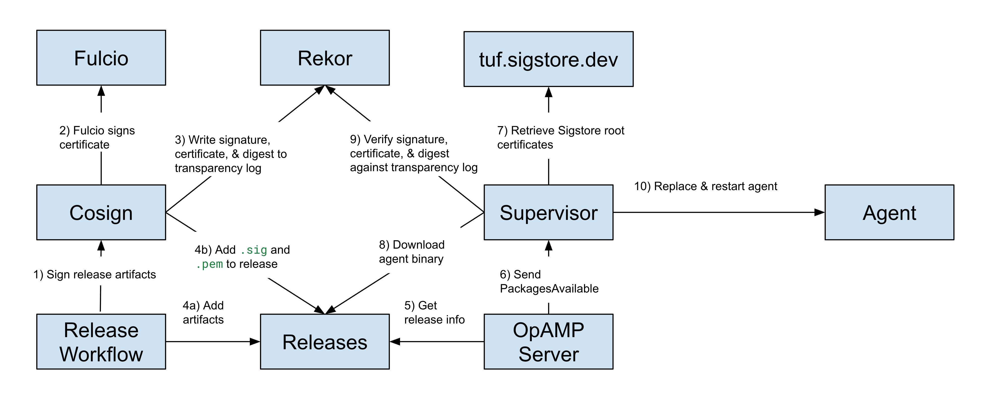

# Agent Upgrades

The Supervisor will download Collector package updates when offered so
by the Backend. The Supervisor will verify the integrity of the packages
and will install them. This requires stopping the Collector, overwriting
the Collector executable file with the newly downloaded version and
starting the Collector. Before overwriting the executable the Supervisor
will save it in case it is necessary for reverting.

## Overview


1. During the release workflow, [Cosign] is used to sign the build artifacts.
2. Cosign gets a signed certificate from [Fulcio]. Fulcio verifies the
Open ID Connect token of the signer before signing the certificate.
3. Cosign writes the computed signature and certificate to the public 
[Rekor] instance.
4. The release workflow adds both the release artifacts and cosign generated signature
and certificate files to the release.
5. An OpAMP server is made aware of the release through some mechanism
(e.g. manually through user intervention, through polling the GitHub API,
etc)
6. The OpAMP server sends a PackagesAvailable message with the new agent
release specified. See the [Expected PackagesAvailable Format](#expected-packagesavailable-format)
section for more information.
7. The supervisor, on startup, has retrieved the sigstore root certificates.
8. The supervisor downloads the agent binary from the releases, using
the URL that the OpAMP server gave it for downloading. After
downloading, it verifies the content hash matches the server
provided content hash from the PackagesAvailable message.
9. The supervisor verifies the certificate via the root certificates downloaded in step 7.
In addition, the supervisor checks against the Rekor transparency log to
verify the certificate hasn't been tampered with.
10. The supervisor replaces and restarts the agent, and the new agent is now running.
The new agent will give its new AgentDescription and will report its new version.

## Expected PackagesAvailable Format

The PackagesAvailable message is expected to contain a single 
package. 
* This package MUST have an empty name. 
* The type of the package MUST be top level. 
* The version field SHOULD be the version of the agent with a `v` prefix.
(e.g. `v0.110.0`)
* The download URL MUST point to a gzipped tarball, containing a file named
`otelcol-contrib`. This file will be used as the agent binary.
* The content hash MUST be the sha256 sum of the gzipped tarball.
* The signature field MUST be a cosign signater, formatted in the way 
described in the [Signature Format](#signature-format) session.

Example:

```go
&protobufs.PackagesAvailable{
    Packages: map[string]*protobufs.PackageAvailable{
        "": {
            Type:    protobufs.PackageType_PackageType_TopLevel,
            Version: "v0.110.0",
            Hash: packageHash
            File: &protobufs.DownloadableFile{
                DownloadUrl: "https://github.com/open-telemetry/opentelemetry-collector-releases/releases/download/v0.111.0/otelcol-contrib_0.111.0_linux_amd64.tar.gz",
                ContentHash: agentSHA256Hash,
                Signature:   signature,
            },
        },
    },
    AllPackagesHash: allPackagesHash,
}
```


## Signing

In order for an agent package to be accepted by the supervisor, the
package MUST be signed. The supervisor expects the agent tarball to be signed
using [Cosign], using the keyless signing method to generate separate certificate 
and signature files.

Both the certificate and cosign signature will be used to create the
file's signature in the PackagesAvailable message.

For more information on keyless signing and Cosign, see the
[Cosign docs](https://docs.sigstore.dev/cosign/signing/overview/).

## Signature Format

In the PackagesAvailable message, the signature MUST be created
by joining the base64 encoded certificate and signature files generated 
by Cosign with a space. Note that the files generated by Cosign are already 
base64 encoded and do not need to be encoded further.

The signature format will therefore be like this:
```
${b64_certificate} ${b64_signature}
```

## Signature Verification

The signature is verified using Cosign. In order to verify the signature,
serveral things are needed:
* A set of identities (issuer/subject pairs) that the signature must
signed by.
  * By default, this will be issuer/subject used to sign the agent release
  from the [opentelemetry-collector-releases](https://github.com/open-telemetry/opentelemetry-collector-releases)
  repository.
* (optional) the name of the github repository that generated the artifact.
  * By default, this is "open-telemetry/opentelemetry-collector-releases".
  * This field may be explicitly set empty to skip verifying the repository field
  in the certificate
* A set of [Fulcio] root certificates.
  * These certificates are retrieved from "https://tuf-repo-cdn.sigstore.dev"
  on startup.
* A URL of a running [Rekor] instance.
    * This is hardcoded to be the public Rekor instance, "https://rekor.sigstore.dev".
* A set of trusted Rekor public keys.
  * These public keys are retrieved from "https://tuf-repo-cdn.sigstore.dev"
  on startup.
* A set of trusted certificate transparency (CT) log public keys
  * These certificates are retrieved from "https://tuf-repo-cdn.sigstore.dev"
  on startup.

For a more in depth explanation of how Cosign/Sigstore works, see
[Sigstore's docs](https://docs.sigstore.dev/about/overview/#how-sigstore-works).

## Artifact signing

Artifacts are signed by Cosign, a Sigstore client. 

During release, the [opentelemetry-collector-releases](https://github.com/open-telemetry/opentelemetry-collector-releases)
repository uses Cosign to sign the artifacts using a OpenID Connect identity token.  This token is used to request a certificate from
[Fulcio].
This certificate contains the identity used to sign the certificate,
and can be used to verify the signer.

After Fulcio verifies the token, it signs a short-lived x509 certificate for 
the release workflow. This certificate's private key is used to compute
a signature for the release artifact (in this case, the agent tarball).

Afterwards, the certificate and signature are written to 
[Rekor], a transparency log.

As a result, both the certificate and signature together can be used to verify
the identity of the signer, verify that the artifact that was downloaded
is the same artifact that was signed, and verify the certificate/signature
was not tampered with via its inclusion in Rekor.

<!-- Links relevant to agent upgrades -->
[Cosign]:(https://github.com/sigstore/cosign)
[Fulcio]:(https://github.com/sigstore/fulcio)
[Rekor]:(https://github.com/sigstore/rekor)
