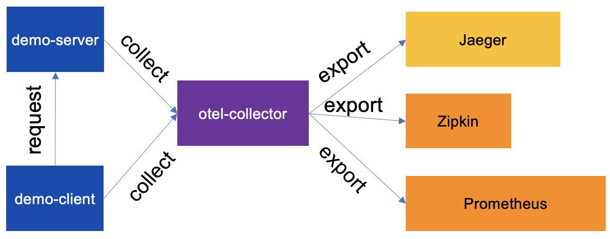

# OpenTelemetry Collector Demo

*IMPORTANT:* This is a pre-released version of the OpenTelemetry Collector Contrib.

This demo contains a client and server applications that use the
opentelemetry Go library for instrumentation and for sending telemetry data
to the opentelemetry collector.

The client periodically makes http calls to the server which
create client spans, server spans and metrics that track information like
number of http requests and latency.

This demo presents the typical flow of observability data with multiple
OpenTelemetry Collectors deployed:



- The client and server send data directly to the OTel Collector;
- The OTel Collector then sends the data to the appropriate backend, in this demo
 Jaeger, Zipkin, and Prometheus;

This demo uses [Docker Compose](https://docs.docker.com/compose/) and by
default runs against the most recent release of `otel/opentelemetry-collector`.
To run the demo, switch to the `examples/demo` folder and run:

```shell
docker compose up -d
```

The demo exposes the following backends:

- Jaeger at `http://0.0.0.0:16686`
- Zipkin at `http://0.0.0.0:9411`
- Prometheus at `http://0.0.0.0:9090`

Notes:

- It may take some time for the application metrics to appear on the Prometheus
 dashboard;

To clean up any docker container from the demo run `docker-compose down` from
the `examples/demo` folder.

### Using a Locally Built Image

Developers interested in running a local build of the Collector need to build a
Docker image using the command below:

```shell
make docker-otelcontribcol
```

Then either modify `examples/demo/docker-compose.yml` to use the newly
`otelcontribcol` image, or create another Compose file that will be merged
with the base Compose file to override the image, like:

```yaml
services:
  otel-collector:
    image: otelcontribcol
```

For more on merging Compose files, see
https://docs.docker.com/compose/how-tos/multiple-compose-files/merge/#how-to-merge-multiple-compose-files
