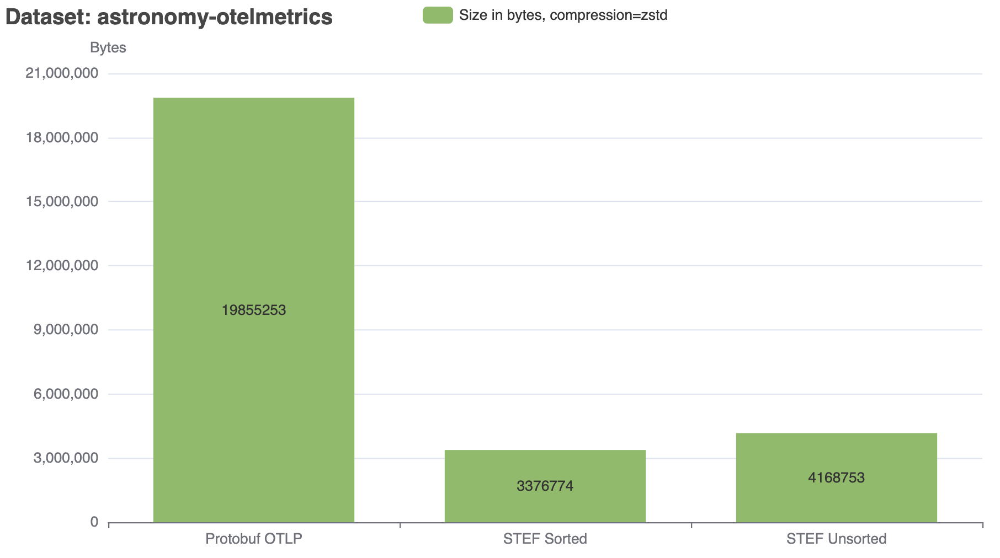

# STEF Exporter

<!-- status autogenerated section -->
| Status        |           |
| ------------- |-----------|
| Stability     | [alpha]: metrics   |
| Distributions | [contrib] |
| Issues        | [](https://github.com/open-telemetry/opentelemetry-collector-contrib/issues?q=is%3Aopen+is%3Aissue+label%3Aexporter%2Fstef) [](https://github.com/open-telemetry/opentelemetry-collector-contrib/issues?q=is%3Aclosed+is%3Aissue+label%3Aexporter%2Fstef) |
| Code coverage | [](https://app.codecov.io/gh/open-telemetry/opentelemetry-collector-contrib/tree/main/?components%5B0%5D=exporter_stef&displayType=list) |
| [Code Owners](https://github.com/open-telemetry/opentelemetry-collector-contrib/blob/main/CONTRIBUTING.md#becoming-a-code-owner)    | [@tigrannajaryan](https://www.github.com/tigrannajaryan), [@dmitryax](https://www.github.com/dmitryax) |

[alpha]: https://github.com/open-telemetry/opentelemetry-collector/blob/main/docs/component-stability.md#alpha
[contrib]: https://github.com/open-telemetry/opentelemetry-collector-releases/tree/main/distributions/otelcol-contrib
<!-- end autogenerated section -->

## Overview

Exports data via gRPC using
[Otel/STEF format](https://github.com/splunk/stef/tree/main/go/otel).
Otel/STEF is a compact and fast telemetry format. It is currently the fastest
benchmarked metric format in the Collector. Here are recent 
[benchmarking results](https://github.com/open-telemetry/opentelemetry-collector-contrib/actions/runs/15381307862/job/43272589155),
comparing CPU usage when using a few different formats (lower is better):

| Test                    | CPU Avg% | CPU Max% |
|-------------------------|---------:|---------:|
| Metric10kDPS/Carbon     |    174.9 |    179.3 |
| Metric10kDPS/OpenCensus |     59.2 |     61.3 |
| Metric10kDPS/OTLP       |     44.8 |     45.7 |
| Metric10kDPS/OTLP-HTTP  |     33.5 |     34.0 |
| Metric10kDPS/SignalFx   |     78.9 |     88.0 |
| Metric10kDPS/STEF       |     20.7 |     21.7 |

STEF in this benchmark outperforms all other formats, including OTLP, which was previously
known as the fastest format in the Collector.

STEF is also very compact on the wire. In uncompressed mode, it typically yields payloads 
that  are more than 10x smaller than OTLP payloads. In compressed mode, STEF is
typically 5-7 times more compact than OTLP.

Here are some 
[STEF benchmark results](https://splunk.github.io/stef/benchmarks/results/benchmarks.html),
comparing STEF and OTLP payload sizes for a few sample payloads produced by Collector:




(This exporter implementation uses unsorted STEF format, labeled "STEF Unsorted" in 
charts above).

There are currently no known formats that match STEF's compactness and performance.

STEF exporter can be used to send metrics from the Collector to any STEF-compatible 
backend. STEF can also be used to send metric data between Collector instances, in which
case on the receiving side a [STEF receiver](../../receiver/stefreceiver/README.md)
should be used.

STEF format, STEF exporter and receiver implementations are currently in alpha 
stage of development, during which **the format may undergo breaking changes.** 
To ensure interoperability between sending and receiving Collectors make sure 
you are using versions of exporter and receiver that are compiled with the same 
version of STEF library.

Feedback about STEF format and implementation is welcome in the form of issues
in this repository or in [STEF repository](https://github.com/splunk/stef/issues).

## Configuration

The following settings are required:

- `endpoint` (no default): host:port to which the exporter is going to send STEF metric data,
  using the STEF/gRPC protocol. The valid syntax is described
  [here](https://github.com/grpc/grpc/blob/master/doc/naming.md). When sending to 
  another Collector you will typically use `<hostname>:4320` as the endpoint, since 
  port 4320 is the default port used by STEF receiver.
  If a scheme of `https` is used then client transport security is enabled and overrides the `insecure` setting.
- `tls`: see [TLS Configuration Settings](https://github.com/open-telemetry/opentelemetry-collector/blob/main/config/configtls/README.md)
  for the full set of available options.

Example:

```yaml
exporters:
  stef:
    endpoint: otelcol2:4317
    tls:
      cert_file: file.cert
      key_file: file.key
  stef/2:
    endpoint: otelcol2:4317
    tls:
      insecure: true
```

By default, no compression is enabled. The only supported compression method is zstd.
To enable compression, configure as follows:

```yaml
exporters:
  otlp:
    ...
    compression: zstd
```

## Advanced Settings

STEF exporter supports the following advanced settings:

- [gRPC settings](https://github.com/open-telemetry/opentelemetry-collector/blob/main/config/configgrpc/README.md)
- [TLS and mTLS settings](https://github.com/open-telemetry/opentelemetry-collector/blob/main/config/configtls/README.md)
- Queuing, timeout and retry settings, particularly:
  - The `timeout` setting controls how long the exporter waits for ACK of a data sent
    over STEF/gRPC stream. Increase this value if you see timeouts in the logs.
  - The `num_consumers` setting defines how many unacknowledged batches can be in-flight.
    If the destination is slow to acknowledge then increasing this
    number can help increase the throughput.
  - For the rest of settings [see here](https://github.com/open-telemetry/opentelemetry-collector/blob/main/exporter/exporterhelper/README.md).
