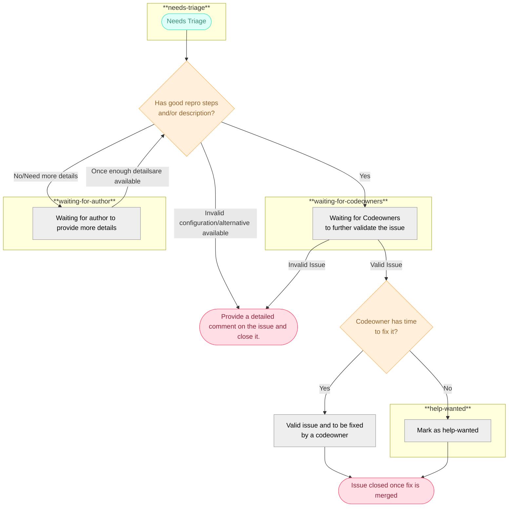

# Issue management

To help provide a consistent process for seeing issues through to completion, this section details some guidelines and
definitions to keep in mind when triaging issues.

### Roles

Determining the root cause of issues is a shared responsibility between those with triager permissions, code owners,
OpenTelemetry community members, issue authors, and anyone else who would like to contribute.

#### Triagers

Contributors with [triager](https://github.com/open-telemetry/opentelemetry-collector-contrib/#contributing) permissions can help move
issues along by adding missing component labels, which help organize issues and trigger automations to notify code owners. They can
also use their familiarity with the Collector and its components to investigate issues themselves. Alternatively, they may point issue
authors to another resource or someone else who may know more.

#### Code Owners

In many cases, the code owners for an issue are the best resource to help determine the root cause of a bug or whether an enhancement
is fit to be added to a component. Code owners will be notified by repository automations when:

- a component label is added to an issue
- an issue is opened
- the issue becomes stale

Code owners may not have triager permissions on the repository,
so they can help triage through investigation and by participating in discussions. They can also help organize issues by
[adding labels via comments](#adding-labels-via-comments).

#### Community Members

Community members or interested parties are welcome to help triage issues by investigating the root cause of bugs, adding input for
features they would like to see, or participating in design discussions.

### Triage process

Triaging an issue requires getting the issue into a state where there is enough information available on the issue or understanding
between the involved parties to allow work to begin or for the issue to be closed. Facilitating this may involve, but is not limited to:

- Determining whether the issue is related to the code or documentation, or whether the issue can be resolved without any changes.
- Ensuring that a bug can be reproduced, and if possible, the behavior can be traced back to the offending code or documentation.
- Determining whether a feature request belongs in a component, should be accomplished through other means, or isn't appropriate for a component at this time.
- Guiding any interested parties to another person or resource that may be more knowledgeable about an issue.
- Suggesting an issue for discussion at a SIG meeting if a synchronous discussion would be more productive.

#### Issue assignment

Issues are assigned for someone to work on by a triager when someone volunteers to work on an issue. Assignment is intended to prevent duplicate work by making it visible who is
working on a particular task. A person who is assigned to the issue may be assigned to help triage the issue and implement it, or can be assigned after the issue has already been
triaged and is ready for work. If someone who is assigned to an issue is no longer able to work on it, they may request to be unassigned from the issue.

### Label Definitions

| Label                | When to apply                                                                                                                                                                                                  |
| -------------------- |----------------------------------------------------------------------------------------------------------------------------------------------------------------------------------------------------------------|
| `bug`                | Something that is advertised or intended to work isn't working as expected.                                                                                                                                    |
| `enhancement`        | Something that isn't an advertised feature that would be useful to users or maintainers.                                                                                                                       |
| `flaky test`         | A test unexpectedly failed during CI, showing that there is a problem with the tests or test setup that is causing the tests to intermittently fail.                                                           |
| `documentation`      | This is a collector usability issue that could likely be resolved by providing relevant documentation. Please consider adding new or improving existing documentation before closing issues with this label.   |
| `good first issue`   | Implementing this issue would not require specialized or in-depth knowledge about the component and is ideal for a new or first-time contributor to take.                                                      |
| `help wanted`        | The code owners for this component do not expect to have time to work on it soon, and would welcome help from contributors.                                                                                    |
| `discussion needed`  | This issue needs more input from the maintainers or community before work can be started.                                                                                                                      |
| `needs triage`       | This label is added automatically, and can be removed when a triager or code owner deems that an issue is either ready for work or should not need any work. See also the [triaging process](#triage-process). |
| `waiting for author` | Can be applied when input is required from the author before the issue can move any further.                                                                                                                   |
| `priority:p0`        | A critical security vulnerability or Collector panic using a default or common configuration unrelated to a specific component.                                                                                |
| `priority:p1`        | An urgent issue that should be worked on quickly, before most other issues.                                                                                                                                    |
| `priority:p2`        | A standard bug or enhancement.                                                                                                                                                                                 |
| `priority:p3`        | A technical improvement, lower priority bug, or other minor issue. Generally something that is considered a "nice to have."                                                                                    |
| `release:blocker`    | This issue must be resolved before the next Collector version can be released.                                                                                                                                 |
| `Sponsor Needed`     | A new component has been proposed, but implementation is not ready to begin. This can be because a sponsor has not yet been decided, or because some details on the component still need to be decided.        |
| `Accepted Component` | A sponsor has elected to take on a component and implementation is ready to begin.                                                                                                                             |
| `Vendor Specific Component` | This should be applied to any component proposal where the functionality for the component is particular to a vendor.                                                                                          |

### State diagram

Here is a diagram outlining the potential issue states and how issues move through different stages:

