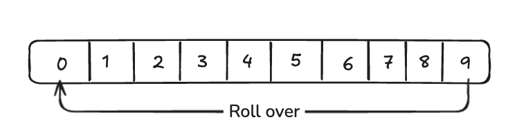
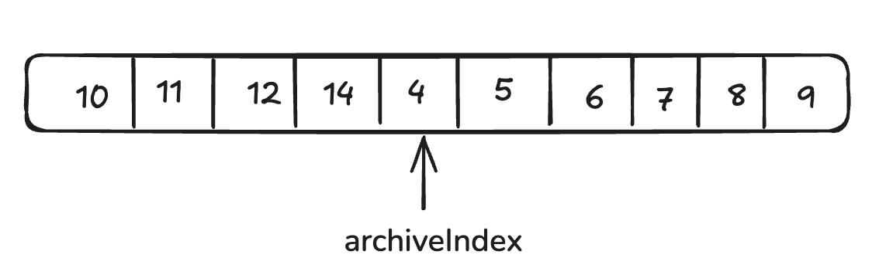
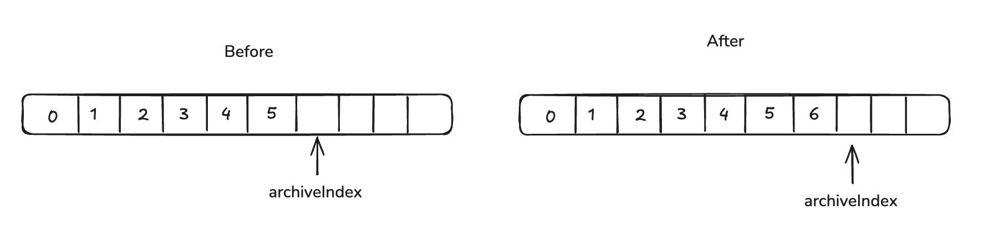
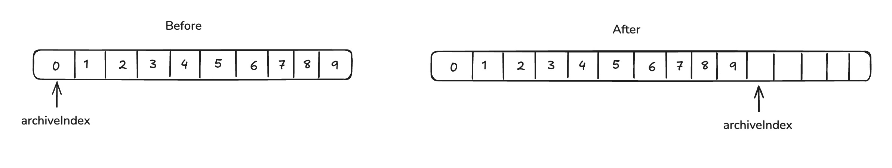
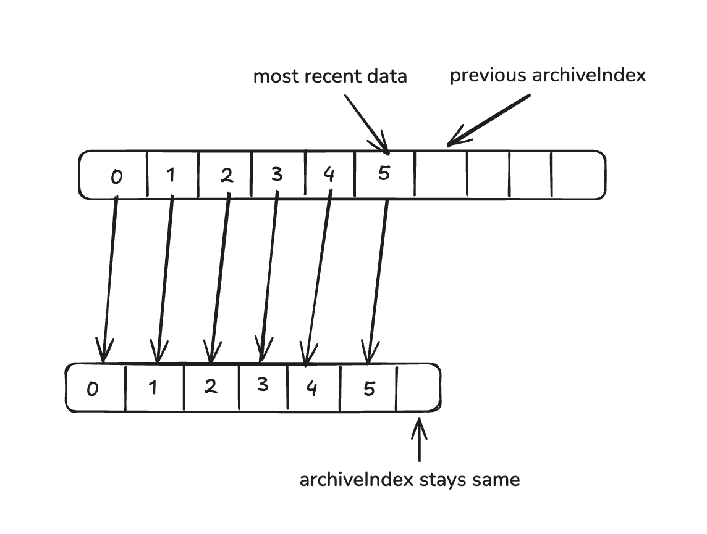
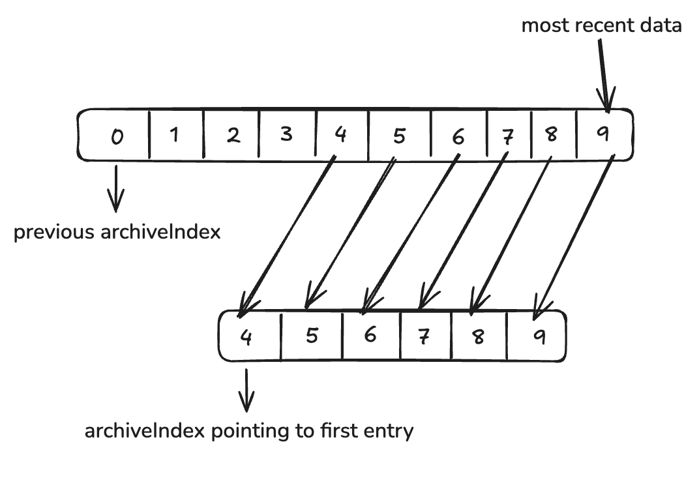
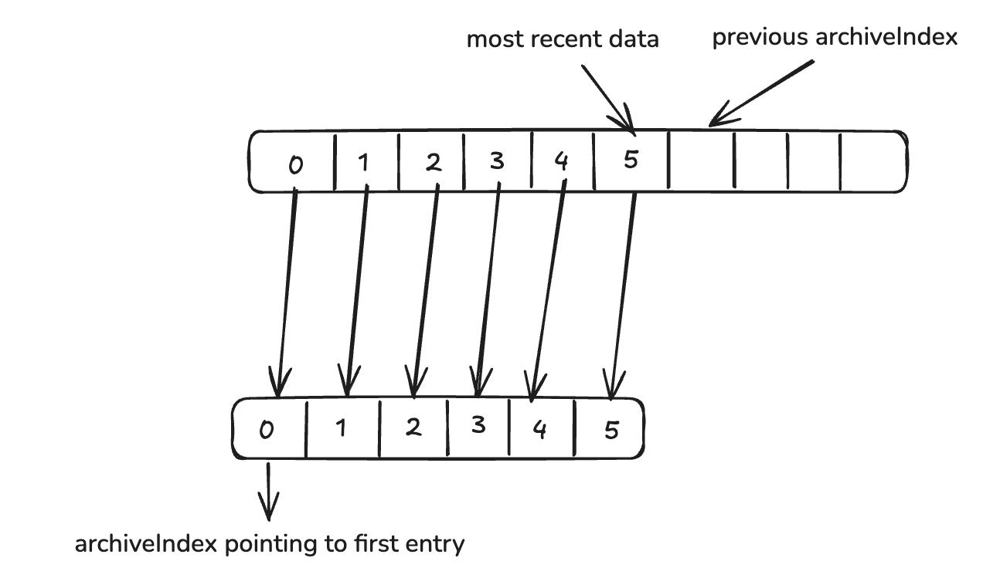

# File archiving

With archiving enabled, file offsets older than three poll cycles are stored on disk rather than being discarded. This feature enabled fileconsumer to remember file for a longer period and also aims to use limited amount of memory. 

## Settings exposed for archiving

1. `polls_to_archive`
    - This settings control the number of poll cycles to archive (above the in-memory three poll cycle limit).
    - If you set `polls_to_archive` to 10, then fileconsumer will store upto 10 poll cycles on disk.


## How does archiving work?

- We stores the offsets older than three poll cycles on disk. If we use `polls_to_archive: 10`, the on-disk structure looks like following:

    - Once we hit the limit of `polls_to_archive` poll cycles, we roll over and overwrite oldest data. The on-disk structure represents a ring buffer
    - We retain a total of 13 poll cycles: 3 cycles in memory and 10 cycles on disk.

Basic terminology before we proceed further:
1. `archiveIndex`: The `archiveIndex` refers to the on-disk position where the next data will be written.
2. `polls_to_archive`: This refers to number of poll cycles to archive or the maximum size of on-disk ring buffer

### How does reading from archiving work?

During reader creation, we group all the new (or unmatched) files and try to find a match in archive. From high level, it consists of following steps:
1. We start from most recently written index on archive and load the data from it.
2. If we don't have any unmatched files, we exit the loop. 
3. We loop through all the unmatched files and the file's fingerprint is cross referenced against archive'd data.
    a. If a match is found, we update the offset for the file
4. We move to next most recent index and continue from step 2. 

Let's take a few examples to understand this:

- Consider the following structure,

    - Here, we have stored data for previous eight poll cycles (3 poll cycles in memory + 5 on disk)
    - When we enter the reading mode, we first read data from most recently written index.
        - The most recently data is stored at `archiveIndex-1` because `archiveIndex` points to the position where the next data will be written.
    - After evaluating data at this index, we move to the next most recent index.
    - We continue this process until one of the following conditions is met:
        - We have no unmatched files left.
        - We have read through the entire archive.
        - We encounter an empty value. This can happen if the archive is partially filled
            - In above diagram, once we reach at the beginning of the archive (i.e. index `0`), we roll over and proceed to the next most recent index. In this case, it is index `9`, which contains no data. 
- Let's take one more example where we have overwritten older data,

    - Here, the archive is completely filled and we have rolled over overwriting older data.
    - `archiveIndex` points to `4` i.e. the least recent data.
    - We first load the most recent data (i.e. `archiveIndex-1`) and try to match offsets against it.
    - Once we evaulate data from this index, we move to previous index and we continue this process until read through the entire archive

### How does writing to archive work?

Writing to archive is rather simple:

- At the end of each poll cycle, instead of purging the readers older than 3 cycles, we move that oldest readers to the archive. 
- We write data to `archiveIndex` and increment the index. Consider the following image:

    - Before the poll cycle, `archiveIndex` is pointed next to `5`.
    - At the end of each poll cycle, we write the data to `archiveIndex` and increment the index.
    - After the cycle, the on-disk structure looks like the one on the right.

## Archive restoration

Archive restoration is an important step if the user changes `polls_to_archive` setting. This section explains how changing this setting impacts the underlying disk structure after a collector run. 

There are two cases to consider:
1. When `polls_to_archive` has increased. In other words, new archive will be larger than older one.
1. When `polls_to_archive` has decreased. In other words, the archive size has shrunk.

### Case 1: `polls_to_archive` has increased
This case is straightforward.

Consider following image,



The previous archive size was `10` and later it got changed to `15`. We just move the `archiveIndex` to next free slot. In this case, the next available slot is at index `10`.

### Case 2: `polls_to_archive` has decreased

There different sub-cases to consider. 

#### Case 2.1: Most recently written index is in bounds w.r.t. new `polls_to_archive`

*Scenario 1: Most recently written index is in bounds and we have overwritten the data atleast once*


Following configurations are in for this case:
- previous `polls_to_archive` was `10`
- new `polls_to_archive` is `7`
- most recently written index is `4` (pointing to data `14`)
- `t.archiveIndex` i.e. least recently written index is `6`

Here, we can see that most recently written index (i.e. `4`) is in bounds w.r.t. new `polls_to_archive` (i.e. `7`). In other words, `most recently written index < new polls_to_archive`. 

We now need to construct a new, smaller archive with 7 most recent elements. 
These elements are (from most recent to least recent):

```14, 13, 12, 11, 10, 9, 8```

We do this in following manner:
- The elements on left of `archiveIndex` will always be included in the new archive. Hence, we don't touch them.
- We then take the remaining elements and reconstruct the archive.
    - The remaining elements are equal to `new polls_to_archive - archiveIndex`.
    - In above image, there are five elements on the left of `archiveIndex` and we will always include them.
    - We take two most recent elements from the right side and include them in archive, discarding remaining

Pseudocode:
```go
if (storage[archiveIndex] == nil ) {
    // we'll talk about this condition in scenario 2
    return
}
most_recent_index := (t.archiveIndex-1) % previous_polls_to_archive // index 5 in above image
least_recent_index := (most_recent_index-new_polls_to_archive) % previous_polls_to_archive // index 8 in above image

for i := 0; i < new_polls_to_archive-archiveIndex; i++ {
    storage[archiveIndex+i] = storage[least_recent_index] // rewrite on left side of storage
    least_recent_index++
}
// archiveIndex remains unchanged in this case, as it's already pointing at the least recently written data.
```

*Scenario 2: Most recently written index is in bounds and we have not overwritten the data*



Following configurations are in for this case:
- previous `polls_to_archive` was `10`
- new `polls_to_archive` is `6`
- most recently written index is `5` (pointing to data `14`)
- `t.archiveIndex` i.e. least recently written index is `6`

If the slot pointed by `archiveIndex` is nil, it means that we haven't rolled over and that the next slots are empty and we don't need to perform any swapping. 
In above pseudocode, the first condition handles this scenario. 

#### Case 2.2: Most recently written index is out of bounds or at bounds w.r.t. new `polls_to_archive`

*Scenario 1: Most recently written index is out of bounds*



Following configurations are in for this case:
- previous `polls_to_archive` was `10`
- new `polls_to_archive` is `5`
- most recently writin index is `9`
- `t.archiveIndex` i.e. least recently written index is `0`

Here, we can see that most recently written index (i.e. `9`) is out of bounds w.r.t. new `polls_to_archive` (i.e. `5`). In other words, `most recently written index > new polls_to_archive`. 

We take five (because new `polls_to_archive` is `5`) most recently written elements and construct a new, smaller archive.
Pseudocode:

```go
most_recent_index := (t.archiveIndex-1) % previous_polls_to_archive // index 9 in above image
least_recent_index := (most_recent_index-new_polls_to_archive) % previous_polls_to_archive // index 4 in above image

for i := 0; i < new_polls_to_archive; i++ {
    storage[i] = storage[least_recent_index] // rewrite from beginning of storage
    least_recent_index++
}
archiveIndex = 0 // point archiveIndex least recently written data
```

The new archive is represented by the lower list in the image above.

*Scenario 2: Most recently written index is at the bounds*



The pseudocode remains same and same steps are performed. 
