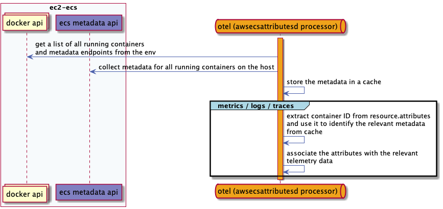

# The awsecsattributes Processor

---

| Status    |                                       |
|-----------|---------------------------------------|
| Stability | beta: logs, metrics, traces, profiles |

This `awsecsattributes` processor was created to collect and associate ECS attributes for collectors deployed as a **daemonset** within ECS.

### How it works



---

When a new container is created in ECS on EC2, the ECS Agent assigns a metadata endpoint, this endpoint is added to the container's env variables. These can be seen under the variables ECS_CONTAINER_METADATA_URI_V4 or ECS_CONTAINER_METADATA_URI, unfortunately, these endpoints seem to be random, and cannot be inferred from the Container ID or ECS Agent itself.

The awsecsattributesd processor works by using the Docker API to identify all metadata ECS Metadata endpoints from the running container environment variables.

It calls all the metadata endpoints and stores all container and task attributes in an internal cache, using the container ID as the key. When telemetry data is received, it checks the user defined source in the resource attributes for the Container ID and uses it to associate the relevant attributes.

### Pre-requisites
- Privileged mode must be enabled for the container running the collector
- The `docker.sock` must be mounted to the container running the collector at `/var/run/docker.sock`
- This processor uses the container ID to identify the correct metadata endpoint for each container. The processor checks for the container ID in **resource** attribute(s) specified during configuration. If no container ID can be determined, no metadata will be added. This applies to logs, metrics, traces, and profiles.

### Attributes

| Attribute                       | Value                                                                               | Default |
|---------------------------------|-------------------------------------------------------------------------------------|---------|
| aws.ecs.task.definition.family  | The ECS task defintion family                                                       | ✔️       |
| aws.ecs.task.definition.version | The ECS task defintion version                                                      | ✔️       |
| image                           | The container image                                                                 | ✔️       |
| aws.ecs.container.name          | The name of the running container. The name given to the container by the ECS Agent | ✔️       |
| aws.ecs.container.arn           | The ECS instance ARN                                                                | ✔️       |
| aws.ecs.cluster                 | The ECS cluster name                                                                | ✔️       |
| aws.ecs.task.arn                | The ECS task ARN                                                                    | ✔️       |
| image.id                        | The image ID of the running container                                               | ✔️       |
| docker.name                     | The name of the running container. The is name you will see if you run `docker ps`  | ✔️       |
| docker.id                       | The docker container ID                                                             | ✔️       |
| name                            | Same as `ecs.container.name`                                                        | ✔️       |
| limits.cpu                      | The CPU limit of the container                                                      |         |
| limits.memory                   | The memory limit of the container                                                   |         |
| type                            | The type of the container                                                           |         |
| aws.ecs.known.status            | The lifecycle state of the container                                                |         |
| created.at                      | The time the container was created                                                  |         |
| `networks.*.ipv4.addresses.*`   | An expression that matches the IP address(s) assigned to a container                |         |
| `networks.*.network.mode`       | An expression that matches the network mode(s) associated with the container        |         |
| labels.*                        | An expression that matches the docker labels associated with the container          |         |

Only containers with a valid ECS metadata endpoint will have attributes assigned, all others will be ignored.

To verify your container has a valid ECS metadata endpoint, you can check for the following environment variables in the your running container:

- ECS_CONTAINER_METADATA_URI
- ECS_CONTAINER_METADATA_URI_V4

Atleast one must be present.

### Configuration

The awsecsattributes processor is enabled by adding the keyword `awsecsattributes` to the `processors` section of the configuration file. The processor can be configured using the following options:

| Config               | Description                                                                                                                                                                      |
|----------------------|----------------------------------------------------------------------------------------------------------------------------------------------------------------------------------|
| attributes           | A list of regex patterns that match specific or multiple attribute keys.                                                                                                         |
| container_id.sources | The **resource** attribute key that contains the container ID. Defaults to `container.id`. If multiple attribute keys are provided, the first none-empty value will be selected. |

Note, given a `log.file.name=<container.id>-json.log`, the `awsecsattributesprocessor` will automatically remove the `-json.log` suffix from the container ID when correlating metadata.

---

The following config, will collect all the [default attributes](#attributes).

```yaml
processors:
  awsecsattributes:

  # check for container id in the following attributes:
  container_id:
    sources:
      - "container.id"
      - "log.file.name"
```

---

You can specify which attributes should be collected by using the `attributes` option which represents a list of regex patterns that match specific or multiple attribute keys.

```yaml
processors:
  awsecsattributes:
    attributes:
      - '^aws.ecs.*' # all attributes that start with ecs
      - '^docker.*' # all attributes that start with docker
      - '^image.*|^network.*' # all attributes that start with image or network
```

---

Below is a complete example for logs. This component was originally created with logs in mind, as there was no way to correlate logs collected via the filelog receiver with its container attributes in ECS. The approach below uses the filelogreceiver to read the logs at the host level, it extracts the container ID from the log.file.path and associates it with the relevant attributes using the awsecsattributesd processor to enrich log data.

```yaml
receivers:
  # Container logs from Docker (enabled by default)
  filelog:
    start_at: end
    force_flush_period: 0
    include:
      - /hostfs/var/lib/docker/containers/*/*.log
    include_file_name: false
    include_file_path: true
    operators:
      # move log file path to resource attributes
      - type: router
        id: docker_log_json_parser
        routes:
          - output: json_parser
            expr: 'body matches "^\\{\"log\".*\\}"'
        default: move_log_file_path

      - type: move
        id: move_log_file_path
        from: attributes["log.file.path"]
        to: resource["log.file.path"]


processors:
  # ECS attributes for container logs, gets the container.id from the log file path.
  awsecsattributesd/container-logs:
    container_id:
      sources:
        - "log.file.path"
```

### Important
- The awsecsattributesdprocessor uses the Docker API to collect metadata for each container. It refreshes the metadata every 60 seconds as well as everytime a new container is detected via Docker events. If the processor is unable to collect metadata for a container or if there are errors during the refresh process, the processor will log the error and continue processing the next log record. It will not halt/crash the open telemetry process. If you notice metadata not being added to your telemetry data, please check the logs for the collector for any errors related to the awsecsattributesdprocessor.

- Note that the ECS-Agent Container in ECS is responsible for orchestrating containers on each node in ECS, it does not have a metadata endpoint, as such, no attributes will be collected for it.

- Containers that are created or run outside of the ECS Process on ECS nodes, will not have ECS Metadata associated.

- As access to the docker API is required, Privileged mode must be enabled for the container running the collector. The docker.sock must be mounted to the container running the collector at /var/run/docker.sock
