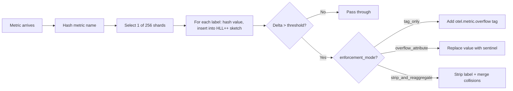

# Cardinality Guardian Processor

<!-- status autogenerated section -->
| Status        |           |
| ------------- |-----------|
| Stability     | [alpha]: metrics   |
| Distributions | [contrib] |
| Issues        | [](https://github.com/open-telemetry/opentelemetry-collector-contrib/issues?q=is%3Aopen+is%3Aissue+label%3Aprocessor%2Fcardinalityguardian) [](https://github.com/open-telemetry/opentelemetry-collector-contrib/issues?q=is%3Aclosed+is%3Aissue+label%3Aprocessor%2Fcardinalityguardian) |
| Code coverage | [](https://app.codecov.io/gh/open-telemetry/opentelemetry-collector-contrib/tree/main/?components%5B0%5D=processor_cardinalityguardian&displayType=list) |
| [Code Owners](https://github.com/open-telemetry/opentelemetry-collector-contrib/blob/main/CONTRIBUTING.md#becoming-a-code-owner)    | [@atoulme](https://www.github.com/atoulme), [@YElayyat](https://www.github.com/YElayyat), [@jmacd](https://www.github.com/jmacd) |

[alpha]: https://github.com/open-telemetry/opentelemetry-collector/blob/main/docs/component-stability.md#alpha
[contrib]: https://github.com/open-telemetry/opentelemetry-collector-releases/tree/main/distributions/otelcol-contrib
<!-- end autogenerated section -->

An OpenTelemetry Collector processor that catches metric cardinality explosions before they reach your TSDB.

It strips only the exploding label — not the entire data point. Your dashboards keep working while the cardinality explosion is neutralized.

## What it does

A code change introduces raw exception strings into `error.type`. Yesterday that label had 5 unique values. Today it has 50,000 and climbing. Your TSDB bill noticed before you did.

This processor sits in your OTel pipeline and detects labels with abnormal growth. It either strips them (enforcement mode) or tags them for routing (tag-only mode). The metric stays intact — only the bad label is removed.

```
Before:  {region="us-east", status="200", error.type="Lock wait timeout; txn=a3f9c..."}
After:   {region="us-east", status="200"}
```

`region` and `status` survive. Your latency dashboards keep working. The 50,000 unique exception strings are gone.

## How it works



Key design decisions:

- **Delta-based detection, not absolute thresholds.** A label with 50K stable values is fine. A label that grew by 100 in the last epoch is a problem. The processor tracks growth rate using dual-epoch HyperLogLog++ sketches, so legitimate high-cardinality metrics aren't penalized.

- **256-way sharding.** Each shard has its own `RWMutex`. With 50 concurrent goroutines across 256 shards, average occupancy is ~0.4 per shard. Contention is near zero. Shard selection is `hash & 0xFF` — one CPU cycle.

- **HLL++ with ~2KB per tracker.** Each sketch estimates cardinality regardless of whether 100 or 100M unique values have been observed. 1-2% accuracy. The `axiomhq/hyperloglog` library's `InsertHash(uint64)` path avoids allocation on the hot path.

- **Stale eviction.** Trackers that haven't been seen for two epochs are cleaned up. Memory stays bounded.

## Comparison with existing processors

| | Cardinality Guardian | filterprocessor | metricstransformprocessor |
|---|---|---|---|
| Detection | Dynamic (growth rate) | Static allow/deny lists | Static rules |
| Granularity | Per-label | Per-metric (drops entire metric) | Per-metric |
| False positives on stable high-cardinality | No (delta-based) | Yes (if above threshold) | Yes |
| Tag-only mode | Yes | No | No |
| Per-metric overrides | Yes | N/A | N/A |
| Top-N offender reporting | Yes | No | No |
| Memory per tracker | ~2KB (HLL++) | N/A | N/A |

`filterprocessor` and `metricstransformprocessor` are configuration-driven: you tell them what to drop. This processor is data-driven: it figures out what to drop based on observed behavior. The use cases are complementary, not competing.

## Configuration

The Cardinality Guardian processor detects labels with abnormal growth using HyperLogLog++ sketches. It measures the *delta* (new unique values per epoch), not absolute cardinality, so stable high-cardinality metrics are never penalized.

Three enforcement modes control what happens when a label exceeds the threshold:

```yaml
processors:
  cardinality_guardian:
    # Max new unique values per (metric, attribute) per epoch
    max_cardinality_delta_per_epoch: 100

    # Epoch rotation interval (seconds, minimum 10)
    epoch_duration_seconds: 300

    # Enforcement mode: tag_only | overflow_attribute | strip_and_reaggregate
    enforcement_mode: tag_only

    # Labels that are never stripped regardless of cardinality
    never_drop_labels:
      - region
      - environment
      - service.name

    # Per-metric threshold overrides (falls back to global if unset)
    metric_overrides:
      http.server.request.duration: 5000
      db.query.duration: 50

    # Emit gauge with top N highest-delta trackers
    top_offenders_count: 10

    # Max tracked metric+label pairs (0 = unlimited)
    max_tracker_count: 100000

    # Dollar value per series prevented, for ROI dashboards
    estimated_cost_per_metric_month: 0.05

    # Cap enforcement Warn logs per epoch (0 = unlimited)
    drop_log_max_per_epoch: 10
```

## Enforcement Modes

### Tag Only

```yaml
enforcement_mode: tag_only
```

Preserves all attributes and injects `otel.metric.overflow: true` on data points that exceed the threshold. No data is modified — this is the safest mode and recommended for initial deployment.

> **Note:** `tag_only` does **not** protect your TSDB on its own — high-cardinality labels still reach your backend unchanged. You must pair it with a downstream [routing processor](https://github.com/open-telemetry/opentelemetry-collector-contrib/tree/main/connector/routingconnector) to split tagged metrics to cheap storage.

### Overflow Attribute

```yaml
enforcement_mode: overflow_attribute
```

Replaces the high-cardinality attribute value with the sentinel string `otel.cardinality_overflow` and performs inline spatial reaggregation to merge data points that now share this identity, resolving the Single-Writer violation. This mode is aligned with the OTel SDK cardinality overflow convention. Supported and unsupported metric types follow the exact same reaggregation rules and fallbacks as `strip_and_reaggregate`.

### Strip and Reaggregate

```yaml
enforcement_mode: strip_and_reaggregate
```

Removes the offending attribute entirely and performs **inline spatial reaggregation** to merge data points that now share the same remaining identity.

Both `strip_and_reaggregate` and `overflow_attribute` modes utilize the spatial reaggregation engine to resolve the Single-Writer violation for supported metric types:

| Metric Type | Reaggregation Support | Merge Semantics |
|---|---|---|
| **Delta Sum** | ✅ Supported | Values are summed; timestamps span the union |
| **Gauge** | ✅ Supported | Last-value-wins by timestamp |
| **Cumulative Sum** | ⚠️ Falls back to `tag_only` | Requires stateful tracking (not yet supported) |
| **Histogram** | ⚠️ Falls back to `tag_only` | Bucket merging requires careful alignment |
| **ExponentialHistogram** | ⚠️ Falls back to `tag_only` | Scale alignment not yet implemented |
| **Summary** | ⚠️ Falls back to `tag_only` | Quantile merging is mathematically invalid |

> **Note:** For metric types that don't yet support reaggregation, the processor automatically falls back to `tag_only` behavior with an `otel.metric.overflow` tag, ensuring no data corruption.

## Warnings

Care needs to be taken when modifying data point attributes using this processor:

- **Single-Writer Conflict**: `strip_and_reaggregate` and `overflow_attribute` both intentionally cause attribute identity collisions and rely on inline spatial reaggregation to merge them. Reaggregation is only safe for Delta Sums and Gauges; Cumulative Sums, Histograms, ExponentialHistograms, and Summaries require stateful tracking that this processor doesn't perform, so they fall back to `tag_only` regardless of the configured mode. `overflow_attribute` is not a valid fallback for those types — collapsing multiple cumulative streams (or merging histogram buckets across mis-aligned scales) is what reaggregation has to solve in the first place.
- **Hash Collisions**: Identity hashing uses `xxhash` with per-`pcommon.ValueType` dispatch and a multiplicative key/value mix to remain order-independent. Theoretical hash collisions are possible but vanishingly rare for typical attribute maps.
- **Future work**: Supporting reaggregation across multiple OTel SDK strategies ([metrics SDK aggregation](https://opentelemetry.io/docs/specs/otel/metrics/sdk/#aggregation)) — e.g. Cumulative Sum reaggregation with stateful tracking, Histogram bucket-aligned merging — is out of scope for this PR but tracked as a follow-up.

## Troubleshooting

The processor emits internal metrics via the OTel SDK to help troubleshoot cardinality explosions:

| Metric | Type | Description |
|---|---|---|
| `processor_cardinality_trackers.active` | Gauge | Current tracked metric+label pairs across all shards |
| `processor_cardinality_labels.stripped` | Counter | Attributes stripped or tagged per data point. Use `rate()` for spike detection. |
| `processor_cardinality_top.offenders` | Gauge | Top N highest-delta trackers with `metric_name` and `label_key` attributes |
| `processor_cardinality_trackers.rejected` | Counter | Trackers rejected after hitting `max_tracker_count` |
| `processor_cardinality_savings.estimated` | Counter | Dollar value of series prevented from reaching your TSDB |

To view the exact top offenders in real time, monitor the `processor_cardinality_top.offenders` internal metric on your collector's `/metrics` endpoint.
