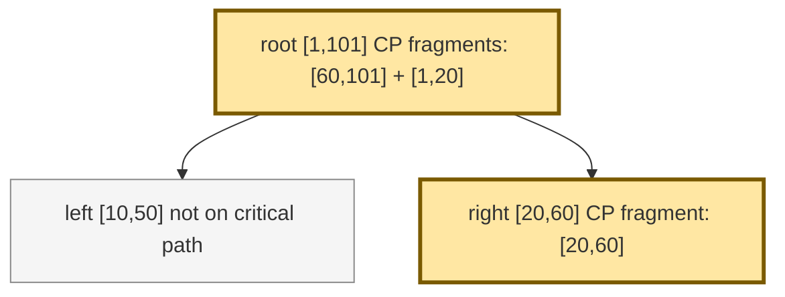

# Critical Path E2E Trace: Jaeger Fixture Style

This shape matches Jaeger's own critical-path fixture semantics: the path is not a single vertical chain. The algorithm re-enters the parent after the latest-finishing child and then continues earlier in the trace.

## Mermaid

## Expected Result

| Span | On critical path | `exclusive_ns` | `inclusive_ns` |
| --- | --- | ---: | ---: |
| `root` | yes | `60` | `100` |
| `left` | no | omitted | omitted |
| `right` | yes | `40` | `40` |

## Why It Matters

- This is the clearest proof that CRISP/Jaeger semantics allow sibling hops.
- The earlier sibling `left` overlaps the trace but is not selected because the algorithm picks the last-finishing child first, then only considers children whose end is strictly before that child's start.
