# Critical Path E2E Scenarios

This file documents the 21 processor-level end-to-end critical-path scenarios in [e2e_critical_path_test.go](/Users/israel.blancas/projects/contrib9/processor/coralogixprocessor/e2e_critical_path_test.go).

Highlighted nodes are expected to be on the critical path.

## 1. `jaeger_fixture_sibling_hop`

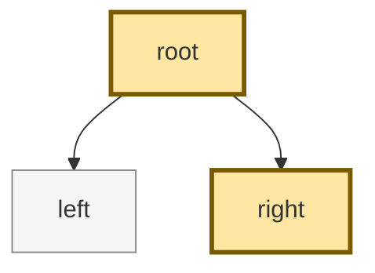

Expected:
- `root`: `exclusive_ns=60`, `inclusive_ns=100`
- `right`: `exclusive_ns=40`, `inclusive_ns=40`

## 2. `vertical_chain`

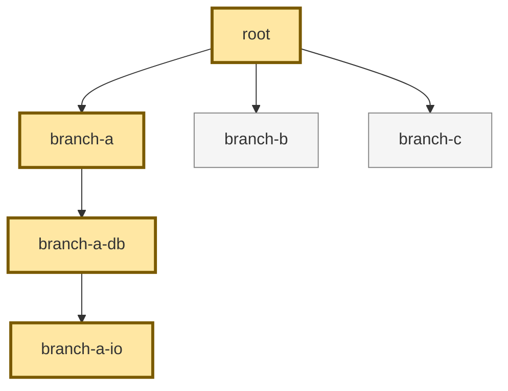

Expected:
- `root`: `10`, `150`
- `branch-a`: `20`, `140`
- `branch-a-db`: `40`, `120`
- `branch-a-io`: `80`, `80`

## 3. `single_span`


Expected:
- `root`: `100`, `100`

## 4. `single_child_full_tail`

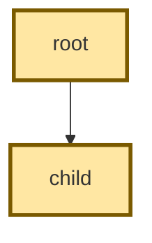

Expected:
- `root`: `20`, `100`
- `child`: `80`, `80`

## 5. `single_child_middle_gap`


Expected:
- `root`: `60`, `100`
- `child`: `40`, `40`

## 6. `two_non_overlapping_siblings`

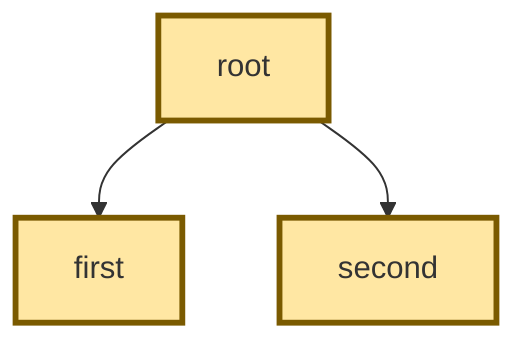

Expected:
- `root`: `70`, `100`
- `first`: `20`, `20`
- `second`: `10`, `10`

## 7. `overlapping_siblings_latest_only`

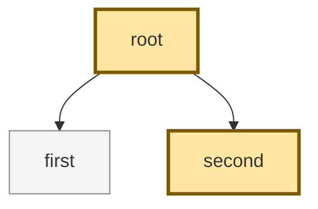

Expected:
- `root`: `70`, `120`
- `second`: `50`, `50`

## 8. `three_sibling_staircase`

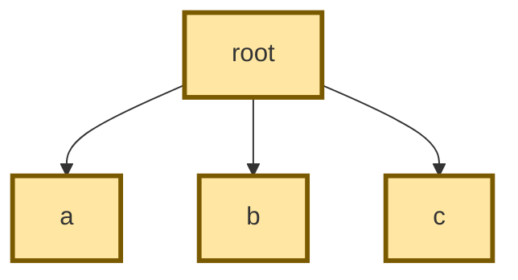

Expected:
- `root`: `100`, `200`
- `a`: `20`, `20`
- `b`: `40`, `40`
- `c`: `40`, `40`

## 9. `nested_chain_with_side_branches`

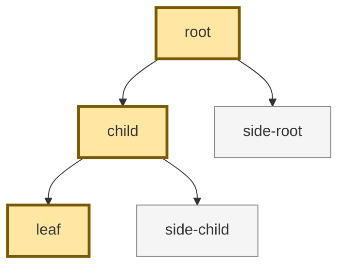

Expected:
- `root`: `40`, `200`
- `child`: `60`, `160`
- `leaf`: `100`, `100`

## 10. `multi_root_missing_parent`

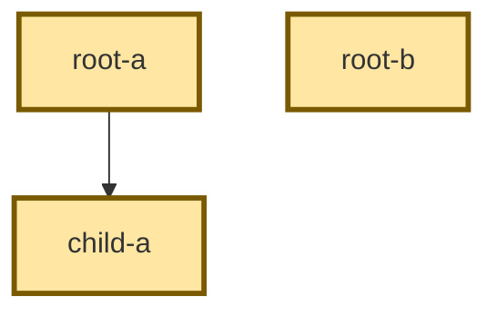

Expected:
- `root-a`: `60`, `100`
- `child-a`: `40`, `40`
- `root-b`: `70`, `70`

## 11. `truncate_child_start`


Expected:
- `root`: `60`, `90`
- `child`: `30`, `30`

## 12. `truncate_child_end`


Expected:
- `root`: `70`, `90`
- `child`: `20`, `20`

## 13. `child_covers_parent_after_truncation`


Expected:
- `root`: `0`, `90`
- `child`: `90`, `90`

## 14. `drop_child_after_parent`

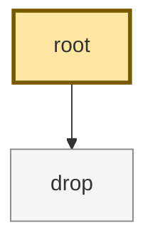

Expected:
- `root`: `90`, `90`

## 15. `deep_sibling_hop`

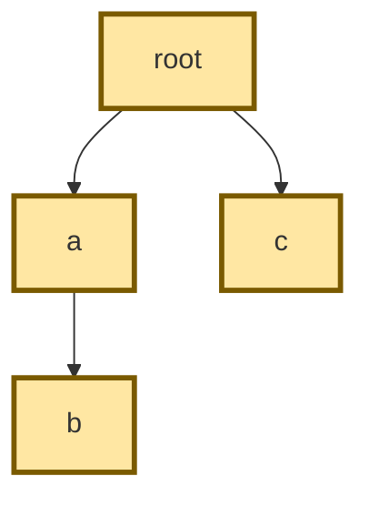

Expected:
- `root`: `50`, `200`
- `a`: `60`, `100`
- `b`: `40`, `40`
- `c`: `50`, `50`

## 16. `tie_same_end_later_start_wins`


Expected:
- `root`: `60`, `100`
- `right`: `40`, `40`

## 17. `tie_same_end_same_start_higher_span_id_wins`


Expected:
- `root`: `60`, `100`
- `right`: `40`, `40`

## 18. `zero_and_invalid_children`

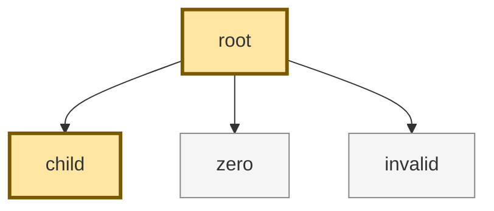

Expected:
- `root`: `70`, `100`
- `child`: `30`, `30`

## 19. `transformed_article_tree`

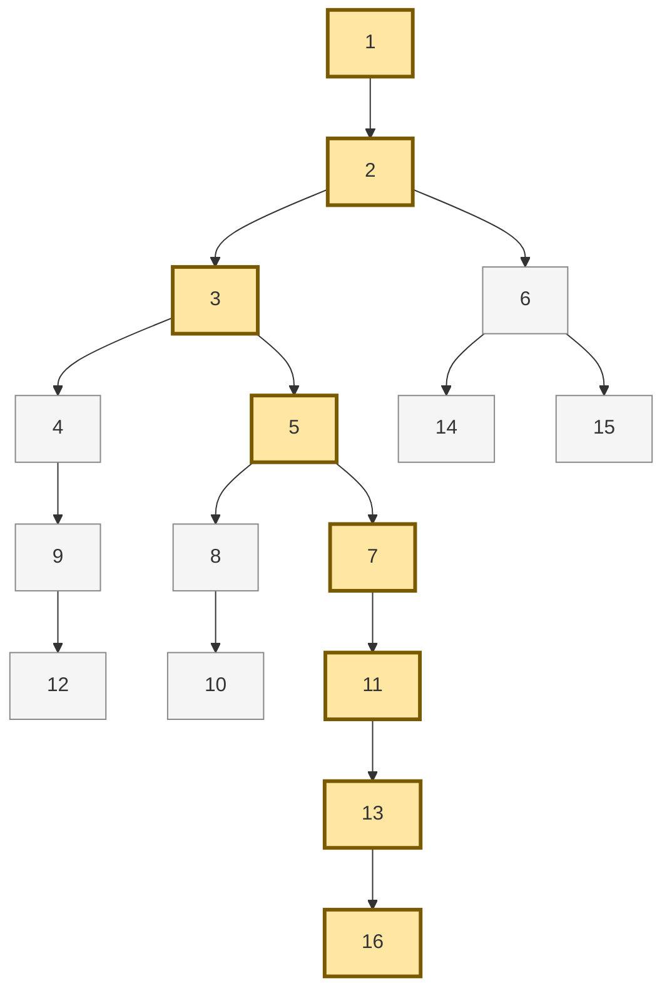

Expected:
- `1`: `10`, `200`
- `2`: `10`, `190`
- `3`: `10`, `180`
- `5`: `10`, `170`
- `7`: `10`, `160`
- `11`: `10`, `150`
- `13`: `10`, `140`
- `16`: `130`, `130`

## 20. `complex_dual_subtrees`

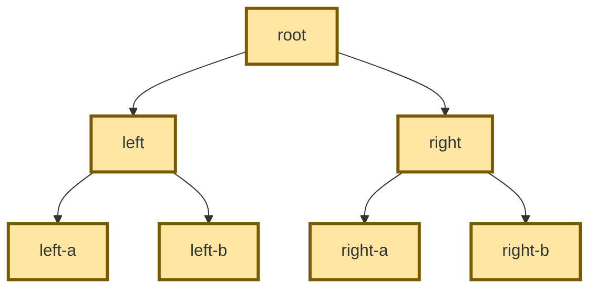

Expected:
- `root`: `60`, `300`
- `left`: `50`, `120`
- `left-a`: `30`, `30`
- `left-b`: `40`, `40`
- `right`: `50`, `120`
- `right-a`: `40`, `40`
- `right-b`: `30`, `30`

## 21. `three_level_sibling_hops`

```mermaid
flowchart TD
    classDef critical fill:#ffe7a3,stroke:#7a5a00,stroke-width:3px;
    R21["root"]:::critical --> A21["a"]:::critical
    A21 --> A121["a1"]:::critical
    A21 --> A221["a2"]:::critical
    R21 --> B21["b"]:::critical
    B21 --> B121["b1"]:::critical
    B21 --> B221["b2"]:::critical
```

Expected:
- `root`: `60`, `250`
- `a`: `30`, `90`
- `a1`: `20`, `20`
- `a2`: `40`, `40`
- `b`: `30`, `100`
- `b1`: `40`, `40`
- `b2`: `30`, `30`

## Source Of Truth

- Executable assertions: [e2e_critical_path_test.go](/Users/israel.blancas/projects/contrib9/processor/coralogixprocessor/e2e_critical_path_test.go)
- Algorithm: [internal/criticalpath/critical_path.go](/Users/israel.blancas/projects/contrib9/processor/coralogixprocessor/internal/criticalpath/critical_path.go)
