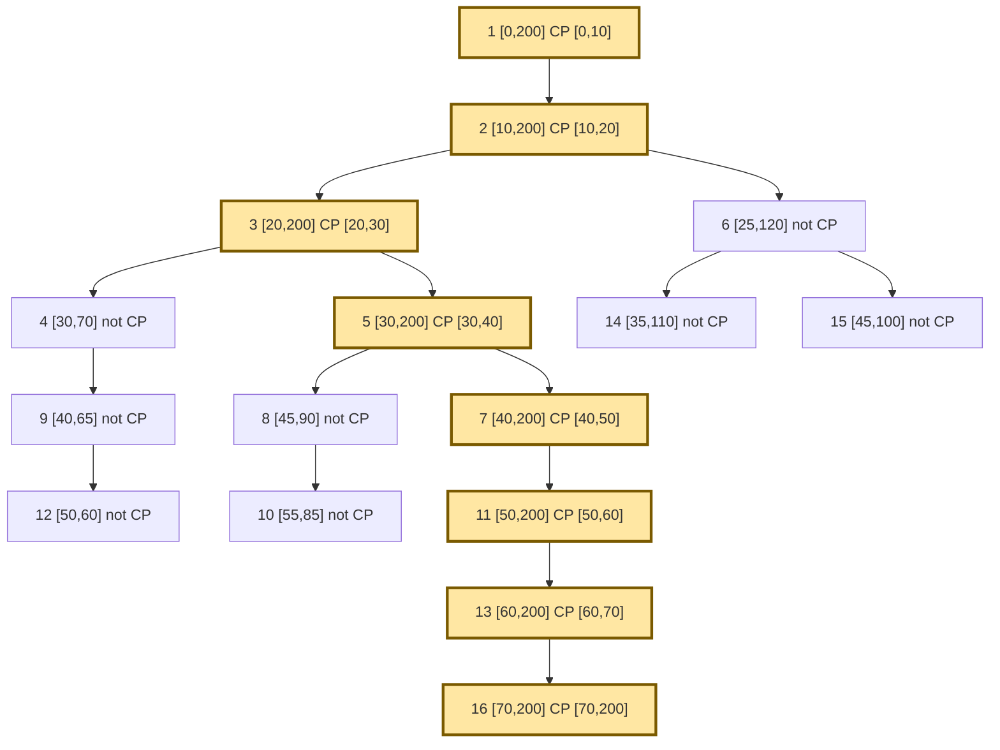

# Critical Path E2E Trace: Article-Inspired Tree Transformation

The published article image appears merge-shaped, which is not directly representable as an OTLP span tree because a span can only have one `parentSpanID`.

This test transforms the shape into a valid tree:

- keep the left critical chain as the main lineage
- keep side branches as sibling subtrees
- replace merge nodes with ordinary descendants under the critical lineage
- keep non-critical branches ending before the next critical segment begins

## Mermaid

## Expected Result

| Span | On critical path | `exclusive_ns` | `inclusive_ns` |
| --- | --- | ---: | ---: |
| `1` | yes | `10` | `200` |
| `2` | yes | `10` | `190` |
| `3` | yes | `10` | `180` |
| `5` | yes | `10` | `170` |
| `7` | yes | `10` | `160` |
| `11` | yes | `10` | `150` |
| `13` | yes | `10` | `140` |
| `16` | yes | `130` | `130` |
| all other spans | no | omitted | omitted |

## Why This Transformation

- Preserves the article's “dominant chain plus side branches” intuition.
- Produces a valid tree for OTel/Jaeger semantics.
- Lets us verify the processor against a complex, multi-branch shape without inventing merge semantics the trace model cannot represent.
