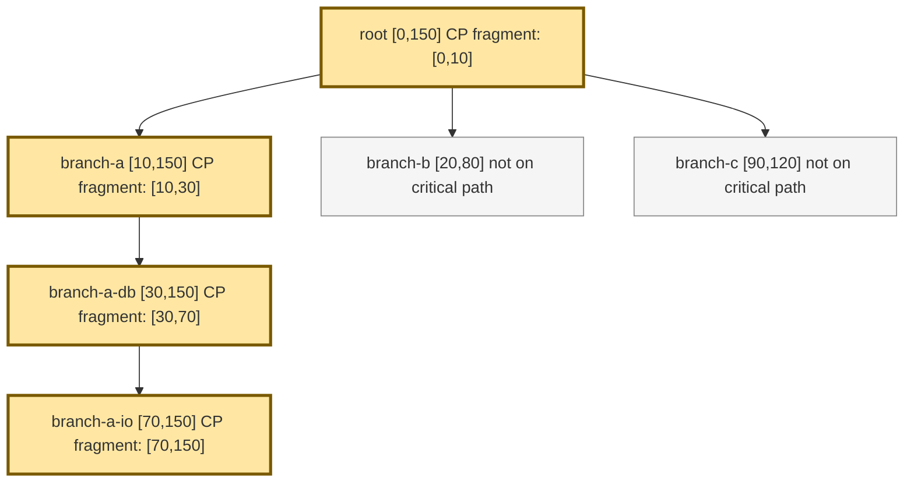

# Critical Path E2E Trace: Vertical Chain

This scenario keeps one dominant branch active all the way to trace completion, so the critical path is a single vertical chain.

## Mermaid

## Expected Result

| Span | On critical path | `exclusive_ns` | `inclusive_ns` |
| --- | --- | ---: | ---: |
| `root` | yes | `10` | `150` |
| `branch-a` | yes | `20` | `140` |
| `branch-a-db` | yes | `40` | `120` |
| `branch-a-io` | yes | `80` | `80` |
| `branch-b` | no | omitted | omitted |
| `branch-c` | no | omitted | omitted |

## Notes

- This shape matches the intuition of one uninterrupted latency-determining chain.
- Sibling branches exist, but they end before the active backward cursor reaches them, so they never become critical-path fragments.
