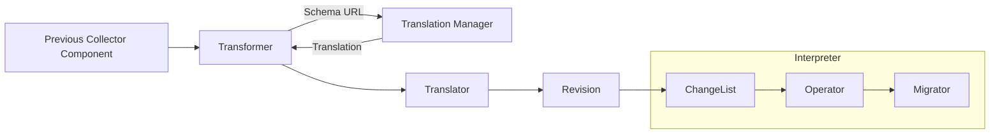

# Design

The Schema Processor is split into several different components.

Here's a general structure diagram:

The [Transformer](transformer.go) is registered as a Processor in the Collector by the factory.
Data flows into the Tranformer, which uses the Schema URL to fetch the translation from the Translation Manager.
The [Translation Manager](internal/translation/manager.go) is responsible for fetching and caching the translations.  It takes in a schema URL and returns a Translator struct.

The Translator struct contains the target schema URL, the target schema version, and a list of Revisions.  The Translator figures out what the version of the incoming data is and what Revisions to apply to the incoming data to get it to the target schema version. The Translator is also responsible for applying the Revisions to the incoming data - it iterates through these Revisions and applies them to the incoming data.   

Each Revision represents all the changes within a specific version.  It consists of several [ChangeLists](internal/changelist/changelist.go) - one for each type of change block (at the time of writing - `all`, `resources`, `spans`, `spanEvents`, `metrics`, `logs`).  Each ChangeList is similar to an interpreter to a programming language - in this case the programming language is the schema file!  Each "change" in the transformation maps to either to an operator or migrator.  [OPEN DESIGN POINT - for the all, logs, and resources type changes - the ChangeList delegates just to an Migrator.  This is a little strange since otherwise it dispatches to an Operator.  Should we just implement Operators for these few cases as well?].  They iterate through whatever changes they are constructed with, and call an operator[operator](internal/operator) or [migrator](internal/migrate) for each type of change.  The operator accepts a typed value - a log, a metric, etc.  It then, under the hood, calls one of a few Migrators.  The Migrators do the fundamental work of changing attributes, changing names, etc.  The Migrators generally operate on lower levels than the Operators - they operate on `Attributes`, or an `alias.NamedSignal` (a signal that implements `Name()` and `SetName()`).  