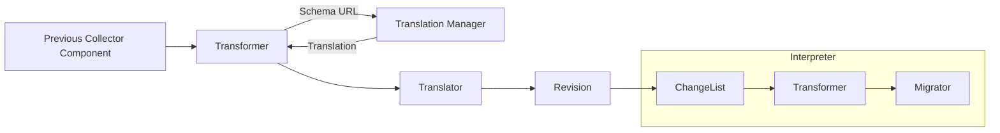

# Design

The Schema Processor is split into several different components.

Here's a general structure diagram:

The [Schema Processor](processor.go) is registered as a Processor in the Collector by the factory.
Data flows into the Transformer, which uses the Schema URL to fetch the translation from the Translation Manager.
The Translation Manager (at internal/translation/manager.go in a future PR) is responsible for fetching and caching the translations.  It takes in a schema URL and returns a Translator struct.

The Translator struct contains the target schema URL, the target schema version, and a list of Revisions.  The Translator figures out what the version of the incoming data is and what Revisions to apply to the incoming data to get it to the target schema version. The Translator is also responsible for applying the Revisions to the incoming data - it iterates through these Revisions and applies them to the incoming data.   

Each Revision represents all the changes within a specific version.  It consists of several ChangeLists (at internal/changelist/changelist.go in a future PR) - one for each type of change block (at the time of writing - `all`, `resources`, `spans`, `spanEvents`, `metrics`, `logs`).  Each ChangeList is similar to a program in an interpreter - in this case the programming language is the schema file!  They iterate through whatever changes they are constructed with, and call a [Transformer](internal/transformer) for each type of change.  The Transformer accepts a typed value - a log, a metric, etc.  It then, under the hood, calls one of a few Migrators.  The Migrators do the fundamental work of changing attributes, changing names, etc.  The Migrators generally operate on lower levels than the Transformers - they operate on `Attributes`, or an `alias.NamedSignal` (a signal that implements `Name()` and `SetName()`).
