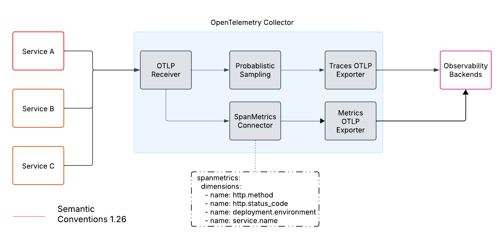
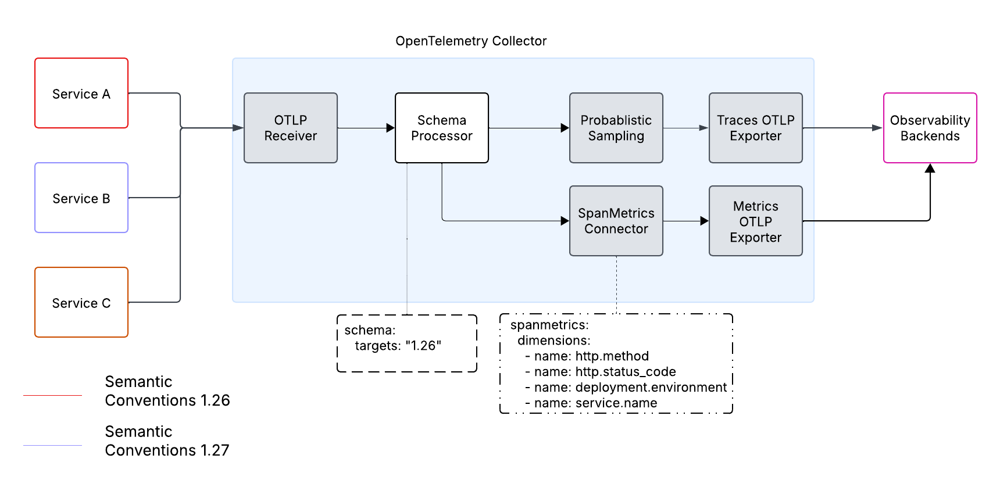

<!-- status autogenerated section -->
# Schema Processor
| Status        |           |
| ------------- |-----------|
| Stability     | [alpha]: traces, metrics, logs   |
| Distributions | [contrib] |
| Issues        | [](https://github.com/open-telemetry/opentelemetry-collector-contrib/issues?q=is%3Aopen+is%3Aissue+label%3Aprocessor%2Fschema) [](https://github.com/open-telemetry/opentelemetry-collector-contrib/issues?q=is%3Aclosed+is%3Aissue+label%3Aprocessor%2Fschema) |
| Code coverage | [](https://app.codecov.io/gh/open-telemetry/opentelemetry-collector-contrib/tree/main/?components%5B0%5D=processor_schema&displayType=list) |
| [Code Owners](https://github.com/open-telemetry/opentelemetry-collector-contrib/blob/main/CONTRIBUTING.md#becoming-a-code-owner)    | [@MovieStoreGuy](https://www.github.com/MovieStoreGuy), [@ankitpatel96](https://www.github.com/ankitpatel96), [@dineshg13](https://www.github.com/dineshg13), [@MikeGoldsmith](https://www.github.com/MikeGoldsmith) |

[alpha]: https://github.com/open-telemetry/opentelemetry-collector/blob/main/docs/component-stability.md#alpha
[contrib]: https://github.com/open-telemetry/opentelemetry-collector-releases/tree/main/distributions/otelcol-contrib
<!-- end autogenerated section -->

The _Schema Processor_ is used to convert existing telemetry data or signals to a version of the semantic convention defined as part of the configuration.
The processor works by using a set of target schema URLs that are used to match incoming signals.
On a match, the processor will fetch the schema translation file (if not cached) set by the incoming signal and apply the transformations
required to export as the target semantic convention version.

Furthermore, it is also possible for organisations and vendors to publish their own semantic conventions and be used by this processor,
be sure to follow [schema overview](https://opentelemetry.io/docs/specs/otel/schemas/) for all the details.

For a practical guide on how to use the processor, including migration workflows and monitoring, see the [Operators Guide](./GUIDE.md).

## Configuration

| Field | Type | Required | Description |
|-------|------|----------|-------------|
| `targets` | `[]string` | Yes | Schema URLs to translate signals to. One per schema family. |
| `prefetch` | `[]string` | No | Schema URLs to download and cache at startup. |
| `migration` | `[]object` | No | Migration entries that preserve old attributes during renames. |
| `migration[].target` | `string` | Yes | Must match one of the configured `targets` exactly. |
| `migration[].from` | `string` | Yes | The schema version being migrated away from. Must be in the same family as `target`. |

## Migration

By default, the processor performs hard renames: when an attribute is migrated, the old name is removed and the new name is written. This can be disruptive during active migrations because queries, dashboards, and alerts referencing old attribute names silently stop matching.

Adding a `migration` section to the config changes this behavior: when an attribute is renamed, both the old and new attribute names are written to the signal. This gives operators a window to update their queries, dashboards, and alerts before committing to the new names.

If both the old and new attribute already exist on an incoming signal, neither is overwritten.

### Scoping with `from`

Each migration entry specifies a `target` (which must match one of the configured targets exactly) and a `from` version. Only renames between the `from` version and the target version are affected — all other renames are applied normally. This works for both upgrades (`from` < target) and downgrades (`from` > target).

The `from` URL must be in the same schema family as the `target`. Each target can have at most one migration entry. Targets without a migration entry are unaffected and apply hard renames as normal.

### Workflow

1. Update the target to the desired version
2. Add a `migration` section with `from` set to the version you are migrating away from
3. Deploy the config change — signals will now have both old and new attribute names
4. Update queries, dashboards, and alerts to reference the new attribute names
5. Remove the `migration` section and redeploy

### Examples

**Upgrade** (migrating from 1.13 to 1.14):
```yaml
processors:
  schema:
    targets:
      - https://opentelemetry.io/schemas/1.14.0
    migration:
      - target: https://opentelemetry.io/schemas/1.14.0
        from: https://opentelemetry.io/schemas/1.13.0
```

**Downgrade** (migrating from 1.20 to 1.19):
```yaml
processors:
  schema:
    targets:
      - https://opentelemetry.io/schemas/1.19.0
    migration:
      - target: https://opentelemetry.io/schemas/1.19.0
        from: https://opentelemetry.io/schemas/1.20.0
```

**Multiple schema families:**
```yaml
processors:
  schema:
    targets:
      - https://opentelemetry.io/schemas/1.14.0
      - https://example.com/schemas/2.0.0
    migration:
      - target: https://opentelemetry.io/schemas/1.14.0
        from: https://opentelemetry.io/schemas/1.13.0
      - target: https://example.com/schemas/2.0.0
        from: https://example.com/schemas/1.9.0
```

> **Note:** While `migration` is active, the number of attributes per signal increases for renamed attributes. Backends sensitive to high cardinality or attribute count may see increased storage or cost. Setting `from` limits the scope to only the renames between two versions.

## Caching Schema Translation Files

In order to improve efficiency of the processor, the `prefetch` option allows the processor to start downloading and preparing
the translations needed for signals that match the schema URL.

The processor caches fetched schema translation files. If a fetch fails, the
processor retries up to `cache_retry_limit` times before entering a cooldown
period of `cache_cooldown` during which further attempts for the same key
return an error immediately.

| Field | Type | Default | Description |
|-------|------|---------|-------------|
| `cache_cooldown` | duration | `5m` | Wait time after retry limit is reached |
| `cache_retry_limit` | int | `5` | Consecutive failures before cooldown |

### Persistent storage

By default, cached schema files are stored in memory and lost when the collector restarts. To persist schemas across restarts, configure a [storage extension](https://github.com/open-telemetry/opentelemetry-collector-contrib/tree/main/extension/storage) using the `storage` field.

When configured, fetched schema files are saved to persistent storage after the first HTTP fetch. On subsequent startups, schemas are loaded from storage without requiring network access. This is useful for:

- **Faster cold starts** — schemas are available immediately without HTTP fetches
- **Offline operation** — the collector can translate schemas without internet access after the initial fetch
- **Reduced load on schema servers** — fewer HTTP requests to the servers hosting the schema files

```yaml
extensions:
  file_storage/schemas:
    directory: /var/lib/otelcol/schema_cache

processors:
  schema:
    targets:
      - https://opentelemetry.io/schemas/1.26.0
    storage: file_storage/schemas

service:
  extensions: [file_storage/schemas]
  pipelines:
    traces:
      processors: [schema]
```

| Field | Type | Default | Description |
|-------|------|---------|-------------|
| `storage` | string | *(none)* | ID of a storage extension to persist cached schema files |

## Schema Formats

A [schema URL](https://opentelemetry.io/docs/specs/otel/schemas/#schema-url) is made up in two parts, _Schema Family_ and _Schema Version_, the schema URL is broken down like so:

```text
|                       Schema URL                           |
| https://example.com/telemetry/schemas/ |  |      1.0.1     |
|             Schema Family              |  | Schema Version |
```

The final path in the schema URL _MUST_ be the schema version and the preceding portion of the URL is the _Schema Family_.

## Targets Schemas

Targets define a set of schema URLs with a schema identifier that will be used to translate any schema URL that matches the target URL to that version.
In the event that the processor matches a signal to a target, the processor will translate the signal from the published one to the defined identifier;
for example using the configuration below, a signal published with the `https://opentelemetry.io/schemas/1.8.0` schema will be translated
by the collector to the `https//opentelemetry.io/schemas/1.6.1` schema.
Within the schema targets, no duplicate schema families are allowed and will report an error if detected.

# Example

```yaml
processors:
  schema:
    prefetch:
      - https://opentelemetry.io/schemas/1.9.0
    targets:
      - https://opentelemetry.io/schemas/1.6.1
      - http://example.com/telemetry/schemas/1.0.1
    # optional: preserve original attributes for renames between from and target
    migration:
      - target: https://opentelemetry.io/schemas/1.6.1
        from: https://opentelemetry.io/schemas/1.5.0
```

For more complete examples, please refer to [config.yml](./testdata/config.yml).

There's a rough design/overview of the processor in the [DESIGN.md](./DESIGN.md) file.

## Why use Schema Processor?

Consider a typical setup of OpenTemetry Collector to process traces.
The collector receives traces from multiple services. The collector uses a spanmetrics connector to compute RED metrics.
The spanmetrics connector computes RED metrics on four dimensions: service and `http.method`, `http.status_code`, and deployment environment. When we use attribute names in the collector configuration or in any of the backends, we implicitly assume that all services produce telemetry with the same semantic conventions.

However, semantic conventions naturally evolve over time. Consider a scenario where deployment environment was originally provided under the attribute `deployment.environment`, but a newer version (e.g., 1.27) updates it to `deployment.environment.name`. Such changes create a tight coupling between the instrumentation in services, the collector configuration, and backend processing, making the entire telemetry pipeline brittle and difficult to update incrementally.

```yaml
receivers:
  otlp:
    protocols:
      grpc:
exporter:
  otlp_grpc:
    endpoint: "localhost:4317"
processors:
  probabilistic_sampler:
    hash_seed: 22
    sampling_percentage: 15
    sampling_priority: priority
connectors:
  spanmetrics:
    dimensions:
      - name: http.method
      - name: http.status_code
      - name: service.name
      - name: deployment.environment
service:
  pipelines:
    traces/red:
      receivers: [otlp]
      exporters: [spanmetrics]
    traces/sampled:
      receivers: [otlp]
      processors: [probabilistic_sampler]
      exporters: [otlp_grpc]
    metrics:
      receivers: [spanmetrics]
      exporters: [otlp_grpc]
```



It is the problem that the schema processor aims to solve. By using the schema processor as first processor in the collector pipeline, we can match the incoming telemetry signals with target version. The collector configuration can use semantics from the target semantic version.

```yaml
processors:
  schema:
    targets:
      - https://opentelemetry.io/schemas/1.26.0
```



## When/Where to use Schema Processor

The Schema Processor should be used in the collector when there are multiple services involved and the configurations expected by the collector configuration use attribute names from a specific semantic convention version.

Isolating and transforming incoming data at the very start of the processing pipeline decouples the service owners from the collector configuration. This means that individual services can upgrade or adjust their telemetry outputs without forcing simultaneous changes to the collector setup.

Schema processor should not be used to downgrade the incoming telemetry signals for more than 3 last versions. We recommend customer to update collector configuration and any other backend configuration at regular intervals to ensure they are using last 3 releases of semantic conventions
