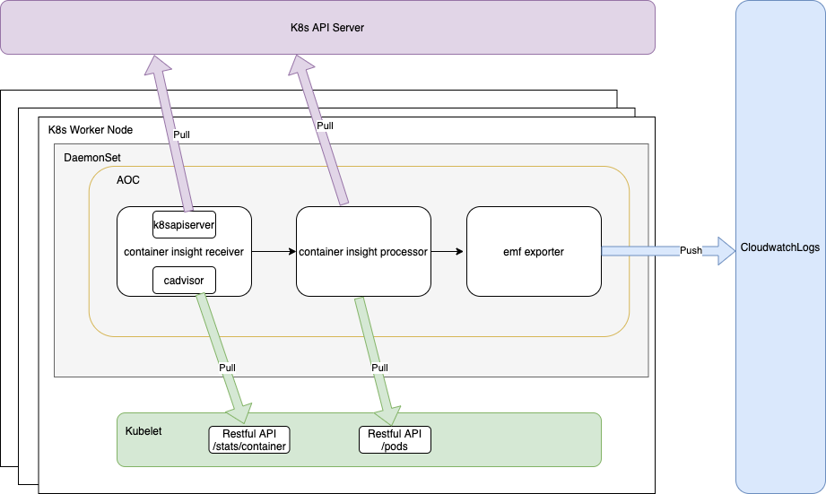

# AWS Container Insights Receiver

## Overview
AWS Container Insights Receiver (`awscontainerinsightreceiver`) is an AWS specific receiver that supports [CloudWatch Container Insights]((https://docs.aws.amazon.com/AmazonCloudWatch/latest/monitoring/ContainerInsights.html)). CloudWatch Container Insights collect, aggregate, 
and summarize metrics and logs from your containerized applications and microservices. Data are collected as as performance log events 
using [embedded metric format](https://docs.aws.amazon.com/AmazonCloudWatch/latest/monitoring/CloudWatch_Embedded_Metric_Format.html). From the EMF data, Amazon CloudWatch can create the aggregated CloudWatch metrics at the cluster, node, pod, task, and service level.

CloudWatch Container Insights has been supported by [ECS Agent](https://github.com/aws/amazon-ecs-agent) and [CloudWatch Agent](https://github.com/aws/amazon-cloudwatch-agent) to collect infrastructure metrics for many resources such as such as CPU, memory, disk, and network. To migrate existing customers to use OpenTelemetry, AWS Container Insights Receiver (together with AWS Container Insights Processor) aims to support the same CloudWatch Container Insights experience for the following platforms:  
  * Amazon ECS 
  * Amazon EKS
  * Kubernetes platforms on Amazon EC2

### Container Insights Architecture
* EKS

Note the current implementation is temporarily hosted in AWS OpenTelemetry Collector repo: https://github.com/aws-observability/aws-otel-collector/tree/main/internal

## Design of AWS Container Insights Receiver for EKS

`awscontainerinsightreceiver` collects data from two main sources:
* `cadvisor` 
  * An customized `cadvisor` lib is embedded inside the receiver. The  `cadvisor` setting is tweaked for Container Insights use cases. For example, only certain metrics are collected and only certain `cgroup` is included. 
  * The receiver generates Container Insights specific metrics from the raw metrics provided by `cadvisor`. The metrics are categorized as different infrastructure layers like node, node filesystem, node disk io, node network, pod, pod network, container, and container filesystem. 
  * Some pod/container related labels like podName, podId, namespace, containerName are extracted from the container spec provided by `cadvisor`. This labels will be added as resource attributes for the metrics and the AWS Container Insights processor needs those attributes to do further processing of the metrics. 
* `k8sapiserver`
  * Collects cluster-level metrics from k8s api server 
  * The receiver is designed to run as daemonset. This guarantees that only one receiver is running per cluster node. To make sure cluster-level metrics are not duplicated, the receiver integrate with K8s client which support leader election API. It leverages k8s configmap resource as some sort of LOCK primitive. The deployment will create a dedicate configmap as the lock resource. If one receiver is required to elect a leader, it will try to lock (via Create/Update) the configmap. The API will ensure one of the receivers hold the lock to be the leader. The leader continually “heartbeats” to claim its leaderships, and the other candidates periodically make new attempts to become the leader. This ensures that a new leader will be elected quickly, if the current leader fails for some reason.  

In addition, some host resource attributes, such as EBS volume, AutoScaling group and ClusterName, are also added to the metrics. The relevant logic is put into the `host` package. 

## Available Metrics and Resource Attributes
### Cluster
| Metric                    | Unit  | Resource Attribute |
|---------------------------|-------|--------------------|
| cluster_failed_node_count | Count | ClusterName        |
| cluster_node_count        | Count | NodeName           |
|                           |       | Type               |
|                           |       | Timestamp          |
|                           |       | Version            |

   

### Cluster Namespace
| Metric                           | Unit  | Resource Attribute |
|----------------------------------|-------|--------------------|
| namespace_number_of_running_pods | Count | ClusterName        |
|                                  |       | NodeName           |
|                                  |       | Namespace          |
|                                  |       | Type               |
|                                  |       | Timestamp          |
|                                  |       | Version            |

   

### Cluster Service
| Metric                         | Unit  | Resource Attribute |
|--------------------------------|-------|--------------------|
| service_number_of_running_pods | Count | ClusterName        |
|                                |       | NodeName           |
|                                |       | Namespace          |
|                                |       | Service            |
|                                |       | Type               |
|                                |       | Timestamp          |
|                                |       | Version            |

   

### Node
| Metric                              | Unit          | Resource Attribute   |
|-------------------------------------|---------------|----------------------|
| node_cpu_limit                      | Millicore     | ClusterName          |
| node_cpu_usage_system               | Millicore     | InstanceType         |
| node_cpu_usage_total                | Millicore     | NodeName             |
| node_cpu_usage_user                 | Millicore     | Timestamp            |
| node_cpu_utilization                | Percent       | Type                 |
| node_memory_cache                   | Bytes         | Version              |
| node_memory_failcnt                 | Count         |                      |
| node_memory_hierarchical_pgfault    | Count/Second  |                      |
| node_memory_hierarchical_pgmajfault | Count/Second  |                      |
| node_memory_limit                   | Bytes         |                      |
| node_memory_mapped_file             | Bytes         |                      |
| node_memory_max_usage               | Bytes         |                      |
| node_memory_pgfault                 | Count/Second  |                      |
| node_memory_pgmajfault              | Count/Second  |                      |
| node_memory_rss                     | Bytes         |                      |
| node_memory_swap                    | Bytes         |                      |
| node_memory_usage                   | Bytes         |                      |
| node_memory_utilization             | Percent       |                      |
| node_memory_working_set             | Bytes         |                      |
| node_network_rx_bytes               | Bytes/Second  |                      |
| node_network_rx_dropped             | Count/Second  |                      |
| node_network_rx_errors              | Count/Second  |                      |
| node_network_rx_packets             | Count/Second  |                      |
| node_network_total_bytes            | Bytes/Second  |                      |
| node_network_tx_bytes               | Bytes/Second  |                      |
| node_network_tx_dropped             | Count/Second  |                      |
| node_network_tx_errors              | Count/Second  |                      |
| node_network_tx_packets             | Count/Second  |                      |

   

### Node Disk IO
| Metric                             | Unit          | Resource Attribute   |
|------------------------------------|---------------|----------------------|
| node_diskio_io_serviced_async      | Count/Second  | AutoScalingGroupName |
| node_diskio_io_serviced_read       | Count/Second  | ClusterName          |
| node_diskio_io_serviced_sync       | Count/Second  | InstanceId           |
| node_diskio_io_serviced_total      | Count/Second  | InstanceType         |
| node_diskio_io_serviced_write      | Count/Second  | NodeName             |
| node_diskio_io_service_bytes_async | Bytes/Second  | Timestamp            |
| node_diskio_io_service_bytes_read  | Bytes/Second  | EBSVolumeId          |
| node_diskio_io_service_bytes_sync  | Bytes/Second  | device               |
| node_diskio_io_service_bytes_total | Bytes/Second  | Type                 |
| node_diskio_io_service_bytes_write | Bytes/Second  | Version              |

   

### Node Filesystem
| Metric                      | Unit    | Resource Attribute   |
|-----------------------------|---------|----------------------|
| node_filesystem_available   | Bytes   | AutoScalingGroupName |
| node_filesystem_capacity    | Bytes   | ClusterName          |
| node_filesystem_inodes      | Count   | InstanceId           |
| node_filesystem_inodes_free | Count   | InstanceType         |
| node_filesystem_usage       | Bytes   | NodeName             |
| node_filesystem_utilization | Percent | Timestamp            |
|                             |         | EBSVolumeId          |
|                             |         | device               |
|                             |         | fstype               |
|                             |         | Type                 |
|                             |         | Version              |

   

### Node Network
| Metric                             | Unit         | Resource Attribute   |
|------------------------------------|--------------|----------------------|
| node_interface_network_rx_bytes    | Bytes/Second | AutoScalingGroupName |
| node_interface_network_rx_dropped  | Count/Second | ClusterName          |
| node_interface_network_rx_errors   | Count/Second | InstanceId           |
| node_interface_network_rx_packets  | Count/Second | InstanceType         |
| node_interface_network_total_bytes | Bytes/Second | NodeName             |
| node_interface_network_tx_bytes    | Bytes/Second | Timestamp            |
| node_interface_network_tx_dropped  | Count/Second | Type                 |
| node_interface_network_tx_errors   | Count/Second | Version              |
| node_interface_network_tx_packets  | Count/Second | interface            |

   

### Pod
| Metric                              | Unit          | Resource Attribute   |
|-------------------------------------|---------------|----------------------|
| pod_cpu_usage_system                | Millicore     | AutoScalingGroupName |
| pod_cpu_usage_total                 | Millicore     | ClusterName          |
| pod_cpu_usage_user                  | Millicore     | InstanceId           |
| pod_cpu_utilization                 | Percent       | InstanceType         |
| pod_memory_cache                    | Bytes         | K8sPodName           |
| pod_memory_failcnt                  | Count         | Namespace            |
| pod_memory_hierarchical_pgfault     | Count/Second  | NodeName             |
| pod_memory_hierarchical_pgmajfault  | Count/Second  | PodId                |
| pod_memory_mapped_file              | Bytes         | Timestamp            |
| pod_memory_max_usage                | Bytes         | Type                 |
| pod_memory_pgfault                  | Count/Second  | Version              |
| pod_memory_pgmajfault               | Count/Second  |                      |
| pod_memory_rss                      | Bytes         |                      |
| pod_memory_swap                     | Bytes         |                      |
| pod_memory_usage                    | Bytes         |                      |
| pod_memory_utilization              | Percent       |                      |
| pod_memory_working_set              | Bytes         |                      |
| pod_network_rx_bytes                | Bytes/Second  |                      |
| pod_network_rx_dropped              | Count/Second  |                      |
| pod_network_rx_errors               | Count/Second  |                      |
| pod_network_rx_packets              | Count/Second  |                      |
| pod_network_total_bytes             | Bytes/Second  |                      |
| pod_network_tx_bytes                | Bytes/Second  |                      |
| pod_network_tx_dropped              | Count/Second  |                      |
| pod_network_tx_errors               | Count/Second  |                      |
| pod_network_tx_packets              | Count/Second  |                      |

   

### Pod Network
| Metric                             | Unit         | Resource Attribute   |
|------------------------------------|--------------|----------------------|
| pod_interface_network_rx_bytes     | Bytes/Second | AutoScalingGroupName |
| pod_interface_network_rx_dropped   | Count/Second | ClusterName          |
| pod_interface_network_rx_errors    | Count/Second | InstanceId           |
| pod_interface_network_rx_packets   | Count/Second | InstanceType         |
| pod_interface_network_total_bytes  | Bytes/Second | K8sPodName           |
| pod_interface_network_tx_bytes     | Bytes/Second | Namespace            |
| pod_interface_network_tx_dropped   | Count/Second | NodeName             |
| pod_interface_network_tx_errors    | Count/Second | PodId                |
| pod_interface_network_tx_packets   | Count/Second | Timestamp            |
|                                    |              | Type                 |
|                                    |              | Version              |
|                                    |              | interface            |

   

### Container
| Metric                                  | Unit          | Resource Attribute   |
|-----------------------------------------|---------------|----------------------|
| container_cpu_usage_system              | Millicore     | AutoScalingGroupName |
| container_cpu_usage_total               | Millicore     | ClusterName          |
| container_cpu_usage_user                | Millicore     | ContainerId          |
| container_cpu_utilization               | Percent       | ContainerName        |
| container_memory_cache                  | Bytes         | InstanceId           |
| container_memory_failcnt                | Count         | InstanceType         |
| container_memory_hierarchical_pgfault   | Count/Second  | K8sPodName           |
| container_memory_hierarchical_pgmajfault| Count/Second  | Namespace            |
| container_memory_mapped_file            | Bytes         | NodeName             |
| container_memory_max_usage              | Bytes         | PodId                |
| container_memory_pgfault                | Count/Second  | Timestamp            |
| container_memory_pgmajfault             | Count/Second  | Type                 |
| container_memory_rss                    | Bytes         | Version              |
| container_memory_swap                   | Bytes         |                      |
| container_memory_usage                  | Bytes         |                      |
| container_memory_utilization            | Percent       |                      |
| container_memory_working_set            | Bytes         |                      |

