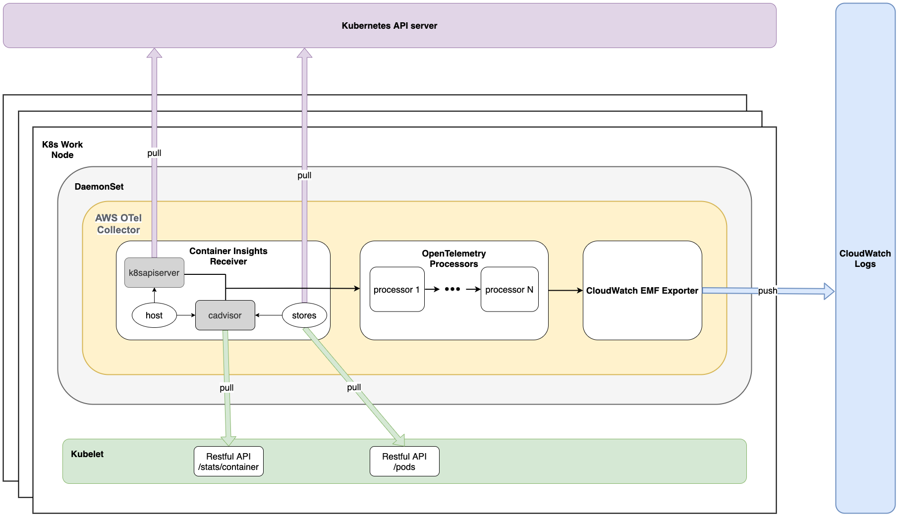

# AWS Container Insights Receiver

## Overview
AWS Container Insights Receiver (`awscontainerinsightreceiver`) is an AWS specific receiver that supports [CloudWatch Container Insights]((https://docs.aws.amazon.com/AmazonCloudWatch/latest/monitoring/ContainerInsights.html)). CloudWatch Container Insights collect, aggregate, 
and summarize metrics and logs from your containerized applications and microservices. Data are collected as as performance log events 
using [embedded metric format](https://docs.aws.amazon.com/AmazonCloudWatch/latest/monitoring/CloudWatch_Embedded_Metric_Format.html). From the EMF data, Amazon CloudWatch can create the aggregated CloudWatch metrics at the cluster, node, pod, task, and service level.

CloudWatch Container Insights has been supported by [ECS Agent](https://github.com/aws/amazon-ecs-agent) and [CloudWatch Agent](https://github.com/aws/amazon-cloudwatch-agent) to collect infrastructure metrics for many resources such as such as CPU, memory, disk, and network. To migrate existing customers to use OpenTelemetry, AWS Container Insights Receiver (together with CloudWatch EMF Exporter) aims to support the same CloudWatch Container Insights experience for the following platforms:  
  * Amazon ECS 
  * Amazon EKS
  * Kubernetes platforms on Amazon EC2


### Container Insights Architecture
* EKS



## Design of AWS Container Insights Receiver for EKS

`awscontainerinsightreceiver` collects data from two main sources:
* `cadvisor` 
  * An customized `cadvisor` lib is embedded inside the receiver. The  `cadvisor` setting is tweaked for Container Insights use cases. For example, only certain metrics are collected and only certain `cgroup` is included. 
  * The receiver generates Container Insights specific metrics from the raw metrics provided by `cadvisor`. The metrics are categorized as different infrastructure layers like node, node filesystem, node disk io, node network, pod, pod network, container, and container filesystem. 
  * Some pod/container related labels like podName, podId, namespace, containerName are extracted from the container spec provided by `cadvisor`. This labels will be added as resource attributes for the metrics and the AWS Container Insights processor needs those attributes to do further processing of the metrics. 
* `k8sapiserver`
  * Collects cluster-level metrics from k8s api server 
  * The receiver is designed to run as daemonset. This guarantees that only one receiver is running per cluster node. To make sure cluster-level metrics are not duplicated, the receiver integrate with K8s client which support leader election API. It leverages k8s configmap resource as some sort of LOCK primitive. The deployment will create a dedicate configmap as the lock resource. If one receiver is required to elect a leader, it will try to lock (via Create/Update) the configmap. The API will ensure one of the receivers hold the lock to be the leader. The leader continually “heartbeats” to claim its leaderships, and the other candidates periodically make new attempts to become the leader. This ensures that a new leader will be elected quickly, if the current leader fails for some reason.  

The following two packages are used to decorate metrics:

* `host`
  * get cpu and mem capacity of the host from `gopsutil`
  * retrieve info about ebs volume, autoscaling group and cluster name from ec2 metadata and ec2 apis


* `stores`
  * pod store:
    * access Kubelet to list all Pod objects running on the same node, and cache all the Pod objects in memory
    * find corresponding pod objects from the cache to decorate pod and container metrics
    * information used to decorate pod and container metrics:
      1. Pod Owner Reference
      2. Container Resource Limit
      3. Container Resource Request
      4. Container ID and Status
      5. Pod Status
      6. Pod Labels
  * service store: 
    * add the corresponding attribute `Service` to the metrics for the relevant pods
    * call "List & Watch" for "Endpoint" objects from Kubernetes API server. In this mode, when there is any change to “Endpoint”, agent will get the notification of the change. The benefit is that the agent could get Endpoint information update in time. If the "Endpoint" resources just occasionally slightly changes, the impact to API server is supposed to be minimal.

## Sample configuration
This is a sample configuration for AWS Container Insights using the `awscontainerinsightreceiver` and `awsemfexporter`:
```
# create namespace
apiVersion: v1
kind: Namespace
metadata:
  name: aws-otel-eks
  labels:
    name: aws-otel-eks

---
# create cwagent service account and role binding
apiVersion: v1
kind: ServiceAccount
metadata:
  name: aws-otel-sa
  namespace: aws-otel-eks

---
kind: ClusterRole
apiVersion: rbac.authorization.k8s.io/v1
metadata:
  name: aoc-agent-role
rules:
  - apiGroups: [""]
    resources: ["pods", "nodes", "endpoints"]
    verbs: ["list", "watch"]
  - apiGroups: ["apps"]
    resources: ["replicasets"]
    verbs: ["list", "watch"]
  - apiGroups: ["batch"]
    resources: ["jobs"]
    verbs: ["list", "watch"]
  - apiGroups: [""]
    resources: ["nodes/proxy"]
    verbs: ["get"]
  - apiGroups: [""]
    resources: ["nodes/stats", "configmaps", "events"]
    verbs: ["create", "get"]
  - apiGroups: [""]
    resources: ["configmaps"]
    resourceNames: ["otel-container-insight-clusterleader"]
    verbs: ["get","update"]

---
kind: ClusterRoleBinding
apiVersion: rbac.authorization.k8s.io/v1
metadata:
  name: aoc-agent-role-binding
subjects:
  - kind: ServiceAccount
    name: aws-otel-sa
    namespace: aws-otel-eks
roleRef:
  kind: ClusterRole
  name: aoc-agent-role
  apiGroup: rbac.authorization.k8s.io

---
apiVersion: v1
kind: ConfigMap
metadata:
  name: otel-agent-conf
  namespace: aws-otel-eks
  labels:
    app: opentelemetry
    component: otel-agent-conf
data:
  otel-agent-config: |
    extensions:
      health_check:

    receivers:
      awscontainerinsightreceiver:

    processors:
      batch/metrics:
        timeout: 60s

    exporters:
      awsemf:
        namespace: ContainerInsights
        log_group_name: '/aws/containerinsights/{ClusterName}/performance'
        log_stream_name: '{NodeName}'
        resource_to_telemetry_conversion:
          enabled: true
        dimension_rollup_option: NoDimensionRollup
        parse_json_encoded_attr_values: [Sources, kubernetes]
        metric_declarations:
          # node metrics
          - dimensions: [[NodeName, InstanceId, ClusterName]]
            metric_name_selectors:
              - node_cpu_utilization
              - node_memory_utilization
              - node_network_total_bytes
              - node_cpu_reserved_capacity
              - node_memory_reserved_capacity
              - node_number_of_running_pods
              - node_number_of_running_containers
          - dimensions: [[ClusterName]]
            metric_name_selectors:
              - node_cpu_utilization
              - node_memory_utilization
              - node_network_total_bytes
              - node_cpu_reserved_capacity
              - node_memory_reserved_capacity
              - node_number_of_running_pods
              - node_number_of_running_containers
              - node_cpu_usage_total
              - node_cpu_limit
              - node_memory_working_set
              - node_memory_limit

          # pod metrics
          - dimensions: [[PodName, Namespace, ClusterName], [Service, Namespace, ClusterName], [Namespace, ClusterName], [ClusterName]]
            metric_name_selectors:
              - pod_cpu_utilization
              - pod_memory_utilization
              - pod_network_rx_bytes
              - pod_network_tx_bytes
              - pod_cpu_utilization_over_pod_limit
              - pod_memory_utilization_over_pod_limit
          - dimensions: [[PodName, Namespace, ClusterName], [ClusterName]]
            metric_name_selectors:
              - pod_cpu_reserved_capacity
              - pod_memory_reserved_capacity
          - dimensions: [[PodName, Namespace, ClusterName]]
            metric_name_selectors:
              - pod_number_of_container_restarts

          # cluster metrics
          - dimensions: [[ClusterName]]
            metric_name_selectors:
              - cluster_node_count
              - cluster_failed_node_count

          # service metrics
          - dimensions: [[Service, Namespace, ClusterName], [ClusterName]]
            metric_name_selectors:
              - service_number_of_running_pods

          # node fs metrics
          - dimensions: [[NodeName, InstanceId, ClusterName], [ClusterName]]
            metric_name_selectors:
              - node_filesystem_utilization

          # namespace metrics
          - dimensions: [[Namespace, ClusterName], [ClusterName]]
            metric_name_selectors:
              - namespace_number_of_running_pods


      logging:
        loglevel: debug

    service:
      pipelines:
        metrics:
          receivers: [awscontainerinsightreceiver]
          processors: [batch/metrics]
          exporters: [awsemf]

      extensions: [health_check]


---
# create Daemonset
apiVersion: apps/v1
kind: DaemonSet
metadata:
  name: aws-otel-eks-ci
  namespace: aws-otel-eks
spec:
  selector:
    matchLabels:
      name: aws-otel-eks-ci
  template:
    metadata:
      labels:
        name: aws-otel-eks-ci
    spec:
      containers:
        - name: aws-otel-collector
          image: {collector-image-url}
          env:
            #- name: AWS_REGION
            #  value: "us-east-1"
            - name: K8S_NODE_NAME
              valueFrom:
                fieldRef:
                  fieldPath: spec.nodeName
            - name: HOST_IP
              valueFrom:
                fieldRef:
                  fieldPath: status.hostIP
            - name: HOST_NAME
              valueFrom:
                fieldRef:
                  fieldPath: spec.nodeName
            - name: K8S_NAMESPACE
              valueFrom:
                 fieldRef:
                   fieldPath: metadata.namespace
          imagePullPolicy: Always
          command:
            - "/awscollector"
              #- "--log-level=DEBUG"
            - "--config=/conf/otel-agent-config.yaml"
          volumeMounts:
            - name: rootfs
              mountPath: /rootfs
              readOnly: true
            - name: dockersock
              mountPath: /var/run/docker.sock
              readOnly: true
            - name: varlibdocker
              mountPath: /var/lib/docker
              readOnly: true
            - name: sys
              mountPath: /sys
              readOnly: true
            - name: devdisk
              mountPath: /dev/disk
              readOnly: true
            - name: otel-agent-config-vol
              mountPath: /conf
          resources:
            limits:
              cpu:  200m
              memory: 200Mi
            requests:
              cpu: 200m
              memory: 200Mi
      volumes:
        - configMap:
            name: otel-agent-conf
            items:
              - key: otel-agent-config
                path: otel-agent-config.yaml
          name: otel-agent-config-vol
        - name: rootfs
          hostPath:
            path: /
        - name: dockersock
          hostPath:
            path: /var/run/docker.sock
        - name: varlibdocker
          hostPath:
            path: /var/lib/docker
        - name: sys
          hostPath:
            path: /sys
        - name: devdisk
          hostPath:
            path: /dev/disk/
      serviceAccountName: aws-otel-sa
```

To deploy to an EKS cluster
```
kubectl apply -f config.yaml
```

## Available Metrics and Resource Attributes
### Cluster
| Metric                    | Unit  |
|---------------------------|-------|
| cluster_failed_node_count | Count |
| cluster_node_count        | Count |

<br/><br/> 
| Resource Attribute |
|--------------------|
| ClusterName        |
| NodeName           |
| Type               |
| Timestamp          |
| Version            |
| Sources            |

<br/><br/> 
<br/><br/> 

### Cluster Namespace
| Metric                           | Unit  |
|----------------------------------|-------|
| namespace_number_of_running_pods | Count |

<br/><br/> 
| Resource Attribute |
|--------------------|
| ClusterName        |
| NodeName           |
| Namespace          |
| Type               |
| Timestamp          |
| Version            |
| Sources            |
| kubernete          |

<br/><br/> 
<br/><br/> 

### Cluster Service
| Metric                         | Unit  |
|--------------------------------|-------|
| service_number_of_running_pods | Count |


<br/><br/> 
| Resource Attribute |
|--------------------|
| ClusterName        |
| NodeName           |
| Namespace          |
| Service            |
| Type               |
| Timestamp          |
| Version            |
| Sources            |
| kubernete          |


<br/><br/> 
<br/><br/> 

### Node
| Metric                              | Unit          |
|-------------------------------------|---------------|
| node_cpu_limit                      | Millicore     |
| node_cpu_request                    | Millicore     |
| node_cpu_reserved_capacity          | Percent       |
| node_cpu_usage_system               | Millicore     |
| node_cpu_usage_total                | Millicore     |
| node_cpu_usage_user                 | Millicore     |
| node_cpu_utilization                | Percent       |
| node_memory_cache                   | Bytes         |
| node_memory_failcnt                 | Count         |
| node_memory_hierarchical_pgfault    | Count/Second  |
| node_memory_hierarchical_pgmajfault | Count/Second  |
| node_memory_limit                   | Bytes         |
| node_memory_mapped_file             | Bytes         |
| node_memory_max_usage               | Bytes         |
| node_memory_pgfault                 | Count/Second  |
| node_memory_pgmajfault              | Count/Second  |
| node_memory_request                 | Bytes         |
| node_memory_reserved_capacity       | Percent       |
| node_memory_rss                     | Bytes         |
| node_memory_swap                    | Bytes         |
| node_memory_usage                   | Bytes         |
| node_memory_utilization             | Percent       |
| node_memory_working_set             | Bytes         |
| node_network_rx_bytes               | Bytes/Second  |
| node_network_rx_dropped             | Count/Second  |
| node_network_rx_errors              | Count/Second  |
| node_network_rx_packets             | Count/Second  |
| node_network_total_bytes            | Bytes/Second  |
| node_network_tx_bytes               | Bytes/Second  |
| node_network_tx_dropped             | Count/Second  |
| node_network_tx_errors              | Count/Second  |
| node_network_tx_packets             | Count/Second  |
| node_number_of_running_containers   | Count         |
| node_number_of_running_pods         | Count         |

<br/><br/> 
| Resource Attribute   |
|----------------------|
| ClusterName          |
| InstanceType         |
| NodeName             |
| Timestamp            |
| Type                 |
| Version              |
| Sources              |
| kubernete            |

<br/><br/> 
<br/><br/> 

### Node Disk IO
| Metric                             | Unit          |
|------------------------------------|---------------|
| node_diskio_io_serviced_async      | Count/Second  |
| node_diskio_io_serviced_read       | Count/Second  |
| node_diskio_io_serviced_sync       | Count/Second  |
| node_diskio_io_serviced_total      | Count/Second  |
| node_diskio_io_serviced_write      | Count/Second  |
| node_diskio_io_service_bytes_async | Bytes/Second  |
| node_diskio_io_service_bytes_read  | Bytes/Second  |
| node_diskio_io_service_bytes_sync  | Bytes/Second  |
| node_diskio_io_service_bytes_total | Bytes/Second  |
| node_diskio_io_service_bytes_write | Bytes/Second  |

<br/><br/> 
| Resource Attribute   |
|----------------------|
| AutoScalingGroupName |
| ClusterName          |
| InstanceId           |
| InstanceType         |
| NodeName             |
| Timestamp            |
| EBSVolumeId          |
| device               |
| Type                 |
| Version              |
| Sources              |
| kubernete            |
<br/><br/> 
<br/><br/> 

### Node Filesystem
| Metric                      | Unit    |
|-----------------------------|---------|
| node_filesystem_available   | Bytes   |
| node_filesystem_capacity    | Bytes   |
| node_filesystem_inodes      | Count   |
| node_filesystem_inodes_free | Count   |
| node_filesystem_usage       | Bytes   |
| node_filesystem_utilization | Percent |

<br/><br/> 
| Resource Attribute   |
|----------------------|
| AutoScalingGroupName |
| ClusterName          |
| InstanceId           |
| InstanceType         |
| NodeName             |
| Timestamp            |
| EBSVolumeId          |
| device               |
| fstype               |
| Type                 |
| Version              |
| Sources              |
| kubernete            |
<br/><br/> 
<br/><br/> 

### Node Network
| Metric                             | Unit         |
|------------------------------------|--------------|
| node_interface_network_rx_bytes    | Bytes/Second |
| node_interface_network_rx_dropped  | Count/Second |
| node_interface_network_rx_errors   | Count/Second |
| node_interface_network_rx_packets  | Count/Second |
| node_interface_network_total_bytes | Bytes/Second |
| node_interface_network_tx_bytes    | Bytes/Second |
| node_interface_network_tx_dropped  | Count/Second |
| node_interface_network_tx_errors   | Count/Second |
| node_interface_network_tx_packets  | Count/Second |

<br/><br/> 
| Resource Attribute   |
|----------------------|
| AutoScalingGroupName |
| ClusterName          |
| InstanceId           |
| InstanceType         |
| NodeName             |
| Timestamp            |
| Type                 |
| Version              |
| interface            |
| Sources              |
| kubernete            |
<br/><br/> 
<br/><br/> 

### Pod
| Metric                                | Unit          |
|---------------------------------------|---------------|
| pod_cpu_limit                         | Millicore     |
| pod_cpu_request                       | Millicore     |
| pod_cpu_reserved_capacity             | Percent       |
| pod_cpu_usage_system                  | Millicore     |
| pod_cpu_usage_total                   | Millicore     |
| pod_cpu_usage_user                    | Millicore     |
| pod_cpu_utilization                   | Percent       |
| pod_cpu_utilization_over_pod_limit    | Percent       |
| pod_memory_cache                      | Bytes         |
| pod_memory_failcnt                    | Count         |
| pod_memory_hierarchical_pgfault       | Count/Second  |
| pod_memory_hierarchical_pgmajfault    | Count/Second  |
| pod_memory_limit                      | Bytes         |
| pod_memory_mapped_file                | Bytes         |
| pod_memory_max_usage                  | Bytes         |
| pod_memory_pgfault                    | Count/Second  |
| pod_memory_pgmajfault                 | Count/Second  |
| pod_memory_request                    | Bytes         |
| pod_memory_reserved_capacity          | Percent       |
| pod_memory_rss                        | Bytes         |
| pod_memory_swap                       | Bytes         |
| pod_memory_usage                      | Bytes         |
| pod_memory_utilization                | Percent       |
| pod_memory_utilization_over_pod_limit | Percent       |
| pod_memory_working_set                | Bytes         |
| pod_network_rx_bytes                  | Bytes/Second  |
| pod_network_rx_dropped                | Count/Second  |
| pod_network_rx_errors                 | Count/Second  |
| pod_network_rx_packets                | Count/Second  |
| pod_network_total_bytes               | Bytes/Second  |
| pod_network_tx_bytes                  | Bytes/Second  |
| pod_network_tx_dropped                | Count/Second  |
| pod_network_tx_errors                 | Count/Second  |
| pod_network_tx_packets                | Count/Second  |
| pod_number_of_container_restarts      | Count         | 
| pod_number_of_containers              | Count         |   
| pod_number_of_running_containers      | Count         |  

| Resource Attribute   |
|----------------------|
| AutoScalingGroupName |
| ClusterName          |
| InstanceId           |
| InstanceType         |
| K8sPodName           |
| Namespace            |
| NodeName             |
| PodId                |
| Timestamp            |
| Type                 |
| Version              |
| Sources              |
| kubernete            |
| pod_status           |


<br/><br/> 

### Pod Network
| Metric                             | Unit         |
|------------------------------------|--------------|
| pod_interface_network_rx_bytes     | Bytes/Second |
| pod_interface_network_rx_dropped   | Count/Second |
| pod_interface_network_rx_errors    | Count/Second |
| pod_interface_network_rx_packets   | Count/Second |
| pod_interface_network_total_bytes  | Bytes/Second |
| pod_interface_network_tx_bytes     | Bytes/Second |
| pod_interface_network_tx_dropped   | Count/Second |
| pod_interface_network_tx_errors    | Count/Second |
| pod_interface_network_tx_packets   | Count/Second |

<br/><br/> 
| Resource Attribute   |
|----------------------|
| AutoScalingGroupName |
| ClusterName          |
| InstanceId           |
| InstanceType         |
| K8sPodName           |
| Namespace            |
| NodeName             |
| PodId                |
| Timestamp            |
| Type                 |
| Version              |
| interface            |
| Sources              |
| kubernete            |
| pod_status           |
<br/><br/> 
<br/><br/> 


### Container
| Metric                                  | Unit          |
|-----------------------------------------|---------------|
| container_cpu_limit                     | Millicore     |
| container_cpu_request                   | Millicore     |
| container_cpu_usage_system              | Millicore     |
| container_cpu_usage_total               | Millicore     |
| container_cpu_usage_user                | Millicore     |
| container_cpu_utilization               | Percent       |
| container_memory_cache                  | Bytes         |
| container_memory_failcnt                | Count         |
| container_memory_hierarchical_pgfault   | Count/Second  |
| container_memory_hierarchical_pgmajfault| Count/Second  |
| container_memory_limit                  | Bytes         |
| container_memory_mapped_file            | Bytes         |
| container_memory_max_usage              | Bytes         |
| container_memory_pgfault                | Count/Second  |
| container_memory_pgmajfault             | Count/Second  |
| container_memory_request                | Bytes         |
| container_memory_rss                    | Bytes         |
| container_memory_swap                   | Bytes         |
| container_memory_usage                  | Bytes         |
| container_memory_utilization            | Percent       |
| container_memory_working_set            | Bytes         |
| number_of_container_restarts            | Count         |

<br/><br/> 

| Resource Attribute                |
|-----------------------------------|
| AutoScalingGroupName              |
| ClusterName                       |
| ContainerId                       |
| ContainerName                     |
| InstanceId                        |
| InstanceType                      |
| K8sPodName                        |
| Namespace                         |
| NodeName                          |
| PodId                             |
| Timestamp                         |
| Type                              |
| Version                           |
| Sources                           |
| kubernetes                        |
| container_status                  |
| container_status_reason           |
| container_last_termination_reason | 

The attribute `container_status_reason` is present only when `container_status` is in "Waiting" or "Terminated" State. The attribute `container_last_termination_reason` is present only when `container_status` is in "Terminated" State.