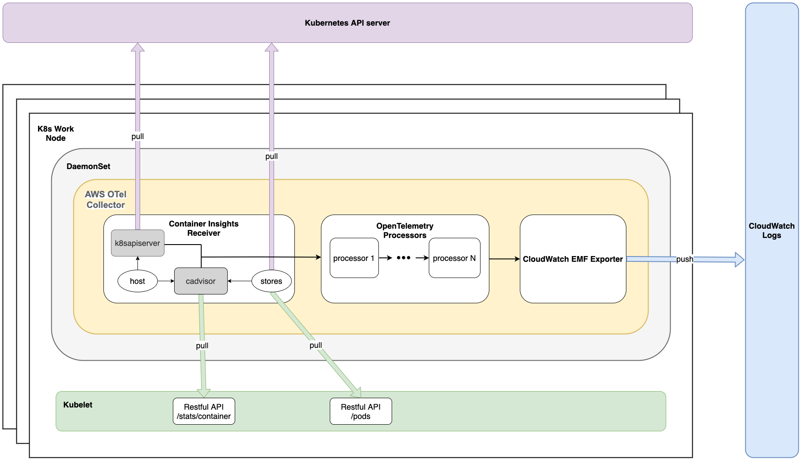
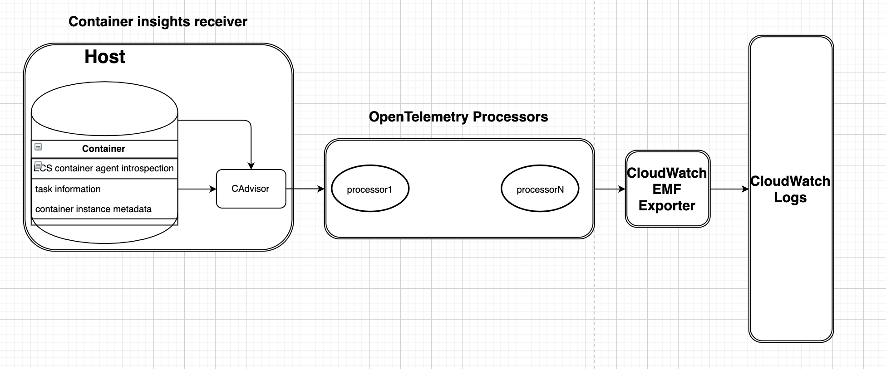

# Design of AWS Container Insights Receiver

## Container Insights Architecture for EKS

## Container Insights Architecture for ECS

## Components of AWS Container Insights Receiver 

`awscontainerinsightreceiver` collects data from two main sources:
* `cadvisor` 
  * A customized `cadvisor` lib is embedded inside the receiver. The  `cadvisor` setting is tweaked for Container Insights use cases. For example, only certain metrics are collected and only certain `cgroup` is included. 
  * The receiver generates Container Insights specific metrics from the raw metrics provided by `cadvisor`. The metrics are categorized as different infrastructure layers like node, node filesystem, node disk io, node network, pod, pod network, container, and container filesystem. 
  * Some pod/container related labels like podName, podId, namespace, containerName are extracted from the container spec provided by `cadvisor`. This labels will be added as resource attributes for the metrics and the AWS Container Insights processor needs those attributes to do further processing of the metrics. 
* `k8sapiserver`
  * Collects cluster-level metrics from k8s api server 
  * The receiver is designed to run as daemonset. This guarantees that only one receiver is running per cluster node. To make sure cluster-level metrics are not duplicated, the receiver integrate with K8s client which support leader election API. It leverages k8s configmap resource as some sort of LOCK primitive. The deployment will create a dedicate configmap as the lock resource. If one receiver is required to elect a leader, it will try to lock (via Create/Update) the configmap. The API will ensure one of the receivers hold the lock to be the leader. The leader continually “heartbeats” to claim its leaderships, and the other candidates periodically make new attempts to become the leader. This ensures that a new leader will be elected quickly, if the current leader fails for some reason.  

The following two packages are used to decorate metrics:

* `host`
  * get cpu and mem capacity of the host from `gopsutil`
  * retrieve info about ebs volume, autoscaling group and cluster name from ec2 metadata and ec2 apis

* `stores`
  * pod store:
    * access Kubelet to list all Pod objects running on the same node, and cache all the Pod objects in memory
    * find corresponding pod objects from the cache to decorate pod and container metrics
    * information used to decorate pod and container metrics:
      1. Pod Owner Reference
      2. Container Resource Limit
      3. Container Resource Request
      4. Container ID and Status
      5. Pod Status
      6. Pod Labels
  * service store: 
    * add the corresponding attribute `Service` to the metrics for the relevant pods
    * call "List & Watch" for "Endpoint" objects from Kubernetes API server. In this mode, when there is any change to “Endpoint”, agent will get the notification of the change. The benefit is that the agent could get Endpoint information update in time. If the "Endpoint" resources just occasionally slightly changes, the impact to API server is supposed to be minimal.

The following package is to collect AWS ECS specific metrics and AWS ECS related resources:

* `ecsInfo`
  * ecs_instance_info will call ECS container agent introspect container instance endpoint to collect the ECS cluster info and container info.
  * ecs_task_info will call ECS container agent introspect task endpoint to collect the ECS task and container info.
  * cgroup will mount the linux host based on the task info to get the cpu_reserved_capacity, memory_reserved_capacity and instance_running_task_number.