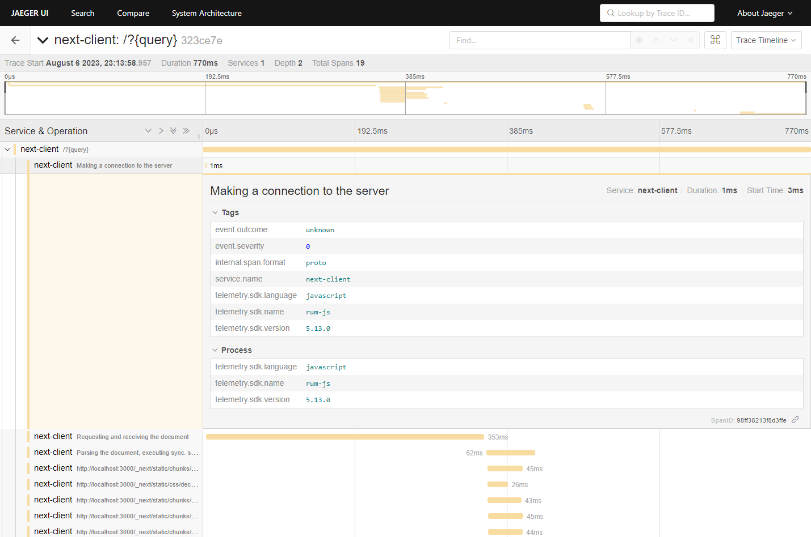

# Elastic APM Receiver

An experimental [OpenTelemetry Collector][otel-collector] receiver for Elastic APM trace data.

Elastic APM agents export telemetry data to [Elastic APM Server][apm-server] via the [Events Intake API][events-v2]. 
With this receiver, agents can point to an OpenTelemetry Collector instance instead and export trace data to any backend supported by OpenTelemetry.

Metrics and logs are currently **not supported**.



**This is a proof of concept. It is not intended for production use.**

## Getting Started

⚠️ This receiver must be built from source. See [Build](#build) for instructions.

The receiver can be configured using the following settings:

- `endpoint` the URI where this receiver can be contacted (default: `0.0.0.0:8200`)
- `events_url_path` the path to the [Events Intake V2][events-v2] endpoint (default: `/intake/v2/events`)
- `rum_events_url_path` the path to the [RUM Events Intake V2][rum-v2] endpoint (default: `/intake/v2/rum/events`)
- `max_event_size_bytes` the maximum size of an event in bytes (default: `300KiB`)
- `batch_size` the maximum number of events to process in a single batch (default: `10`)

See [OTel Collector Server Configuration][server-configuration] for more options (e.g. CORS, TLS, Headers, Auth).


## Build 

Use [OpenTelemetry Collector Builder][ocb] to build a binary with this receiver included.

Extend `builder-config.yaml` to include a receiver configuration for the Elastic APM receiver. For example:

```yaml
receivers:
  - gomod: github.com/ldgrp/elasticapmreceiver v0.0.0
```

Then build the binary:

```bash
$ ocb --config builder-config.yaml
```

## How it works

This receiver depends heavily on the latest [`elastic/apm-data`][apm-data] package to process incoming
requests and convert them into an `APMEvent` struct. This struct is then converted
to an OpenTelemetry span and scheduled for export.

- The Elastic APM RUM JS Agent exports transactions with a `duration` attribute, without a `timestamp` attribute.
Traditionally, APM Server is in charge of setting the `timestamp` attribute https://github.com/elastic/apm-server/issues/723. Equivalently, this receiver sets the `timestamp` attribute to the current time.

- Elastic APM Agents periodically poll APM Server for [configuration changes][central-config]. This receiver does not support this feature.

[apm-data]: https://github.com/elastic/apm-data
[apm-server]: https://www.elastic.co/guide/en/apm/guide/current/getting-started-apm-server.html
[central-config]: https://www.elastic.co/guide/en/kibana/8.9/agent-configuration.html#agent-configuration
[elastic-apm]: https://www.elastic.co/guide/en/observability/current/index.html
[events-v2]: https://www.elastic.co/guide/en/apm/guide/current/api-events.html
[ocb]: https://github.com/open-telemetry/opentelemetry-collector/tree/main/cmd/builder
[otel-collector]: https://opentelemetry.io/docs/collector/
[rum-v2]: https://www.elastic.co/guide/en/apm/guide/current/api-events.html
[server-configuration]: https://github.com/open-telemetry/opentelemetry-collector/tree/main/config/confighttp#server-configuration