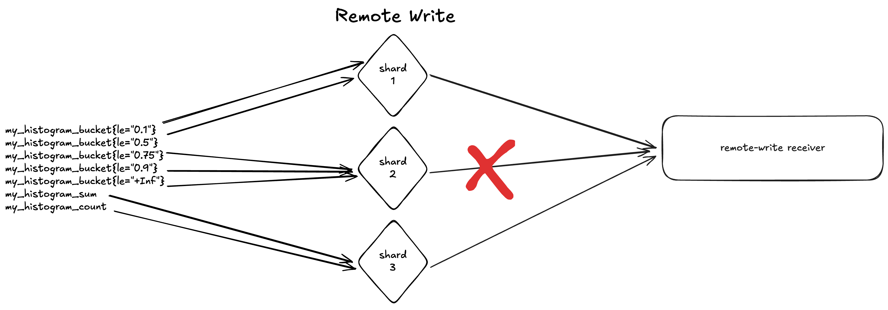

# Prometheus Remote Write Receiver

<!-- status autogenerated section -->
| Status        |           |
| ------------- |-----------|
| Stability     | [alpha]: metrics   |
| Distributions | [contrib] |
| Issues        | [](https://github.com/open-telemetry/opentelemetry-collector-contrib/issues?q=is%3Aopen+is%3Aissue+label%3Areceiver%2Fprometheusremotewrite) [](https://github.com/open-telemetry/opentelemetry-collector-contrib/issues?q=is%3Aclosed+is%3Aissue+label%3Areceiver%2Fprometheusremotewrite) |
| Code coverage | [](https://app.codecov.io/gh/open-telemetry/opentelemetry-collector-contrib/tree/main/?components%5B0%5D=receiver_prometheusremotewrite&displayType=list) |
| [Code Owners](https://github.com/open-telemetry/opentelemetry-collector-contrib/blob/main/CONTRIBUTING.md#becoming-a-code-owner)    | [@dashpole](https://www.github.com/dashpole), [@ArthurSens](https://www.github.com/ArthurSens), [@perebaj](https://www.github.com/perebaj) |

[alpha]: https://github.com/open-telemetry/opentelemetry-collector/blob/main/docs/component-stability.md#alpha
[contrib]: https://github.com/open-telemetry/opentelemetry-collector-releases/tree/main/distributions/otelcol-contrib
<!-- end autogenerated section -->

## Prometheus Compatibility

This receiver implements the [Prometheus Remote Write 2.0 protocol](https://prometheus.io/docs/specs/prw/remote_write_spec_2_0/), which is still evolving. As the protocol specification changes, we update our implementation to match, which can affect compatibility with different Prometheus versions.

| OTel Collector Contrib Version | Compatible Prometheus Versions |
|-------------------------------|-------------------------------|
| v0.141.0 and earlier | Prometheus 3.7.x and earlier |
| v0.142.0 and later | Prometheus 3.8.0 and later |

The breaking change in Prometheus 3.8.0 ([prometheus/prometheus#17411](https://github.com/prometheus/prometheus/pull/17411)) updated the Remote Write 2.0 spec from rc.3 to rc.4, renaming `CreatedTimestamp` to `StartTimestamp` and moving it from the `TimeSeries` message to individual `Sample` and `Histogram` messages. This is a wire-protocol incompatibility, so mismatched versions will not work correctly together.

## Configuring `PrometheusRemoteWriteReceiver`

This component's configuration is based on [confighttp](https://github.com/open-telemetry/opentelemetry-collector/tree/main/config/confighttp). A minimal example can be seen below:

```yaml
receivers:
  prometheusremotewrite:
    endpoint: 0.0.0.0:9090
```

## Configuring your Prometheus

To make Prometheus work with this component, you'll need to add a few extra configuration options. As described below:

### Metadata WAL Records feature flag

Prometheus' Remote Write implementation relies on flushing the WAL records into its Remote Write Queue Manager. By default, metadata information, like metric Type, Unit and Help description, are not appended to the WAL. Since we require such information to translate Remote-Write into OTLP, Prometheus default configuration won't work here.

When spinning up your Prometheus, make sure you enable the [metadata-wal-records feature flag](https://prometheus.io/docs/prometheus/latest/feature_flags/#metadata-wal-records):

```console
./prometheus --config.file config.yml --enable-feature=metadata-wal-records
```

### Remote Write Protobuf message

This component focuses exclusively on [Prometheus Remote Write v2 Protocol](https://prometheus.io/docs/specs/prw/remote_write_spec_2_0/).
To enable it, please add the appropriate `protobuf_message` in your remote write configuration block:

```yaml
remote_write:
  - url: "<your chosen Promtheus Remote Write Receiver endpoint>"
    protobuf_message: io.prometheus.write.v2.Request
```

### Why Not support Prometheus Remote Write v1?

We don't support Prometheus Remote Write v1 for a couple of reasons, which are explained below.

#### Histogram Atomicity

Prometheus Remote Write v1 was developed before Prometheus Native Histograms were a thing. The original Histogram format, commonly known as Prometheus Classic Histograms, is composed of several separate time series that together work as a whole histogram. Each time series holds a single information, whether the bucket boundaries, the sum of all observations, or the count of observations.

Now, being more specific to Prometheus Remote Write implementation. It was developed using the algorithm [EWMA (Exponential Weighted Moving Average)](https://corporatefinanceinstitute.com/resources/career-map/sell-side/capital-markets/exponentially-weighted-moving-average-ewma/), used to control throughput. Simply put, the more time-series Prometheus is ingesting, the more workers Prometheus spins up to push metrics via Remote Write, and a decrease in worker count also happens when ingestion decreases.

Since Classic Histograms are made of multiple time series, there is a high chance that parts of them are sent to the remote storage in separate remote-write requests. If, for any reason, one of those requests fails, it is impossible for the receiver to know if the time series it received was already enough to assemble and generate a complete histogram.



This problem was solved in Prometheus Remote Write v2 with the introduction of [Native Histograms](https://prometheus.io/docs/specs/native_histograms/).

#### Decoupled Metadata

While, officially, Prometheus Remote Write v1 does NOT support sending metadata, e.g., Metric Type, Unit, and Help description. It was developed versions of the protocol where metadata can be sent separately from the metric.

Similarly to the problem mentioned in [Histogram Atomicity](#histogram-atomicity), sending this kind of information separately can cause issues if the data is lost during transport, not to mention the necessity of caching metrics or metric metadata while we wait for the subsequent request that will connect the two.

In Prometheus Remote Write v2, this problem is solved since the time series are sent together with their metadata.

#### Lack of Created Timestamp

`Created Timestamp` is a feature in Prometheus that works similarly and is translated to OTel's `StartTimeUnixNano`. Prometheus Remote Write v1 doesn't send Created Timestamps, so we can never populate the StartTimeUnixNano field from that protocol.

## Known Limitations

### Summaries and Classic Histograms are unsupported

As mentioned in [Histogram Atomicity](#histogram-atomicity), Prometheus Classic Histograms are split into several separate time series and, for this reason, it is impossible to determine if the amount of buckets received are the complete set. 

Summaries suffer from the same problem, a working Summary is composed by several time series just like Classic Histograms. The only difference is that instead of bucket boundaries, these time series represent pre-calculated quantiles. Since the quantiles can be sent in separate Remote Write requests, it's impossible to determine if the amount of quantiles received are enough to generate a complete Summary.

### Resource Metrics Cache

`target_info` metrics and "normal" metrics are a match when they have the same job/instance labels (Please read the [specification](https://opentelemetry.io/docs/specs/otel/compatibility/prometheus_and_openmetrics/#resource-attributes-1) for more details). But these metrics do not always come in the same Remote-Write request. For this reason, the receiver uses an internal LRU (Least Recently Used) and stateless cache implementation to store resource metrics across requests.

The cleanup is based on a maximum size of 1000 resource metrics, and it will be cleaned when the limit is reached, cleaning the less recently used resource metrics.

This approach has some limitations, for example:
    - If the process dies or restarts, the cache will be lost.
    - Some inconsistencies can happen according to the order of the requests and the current cache size.
    - The limit of 1000 resource metrics is hardcoded and not configurable for now.
