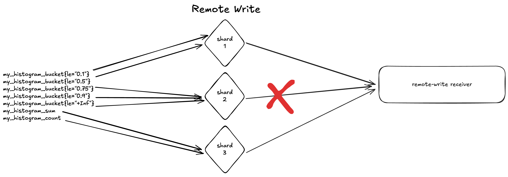

<!-- status autogenerated section -->
# Prometheus Remote Write Receiver

This receiver implements the
[Prometheus Remote Write 2.0 protocol](https://prometheus.io/docs/specs/prw/remote_write_spec_2_0/).

| Status        |           |
| ------------- |-----------|
| Stability     | [alpha]: metrics   |
| Distributions | [contrib] |
| Issues        | [](https://github.com/open-telemetry/opentelemetry-collector-contrib/issues?q=is%3Aopen+is%3Aissue+label%3Areceiver%2Fprometheusremotewrite) [](https://github.com/open-telemetry/opentelemetry-collector-contrib/issues?q=is%3Aclosed+is%3Aissue+label%3Areceiver%2Fprometheusremotewrite) |
| Code coverage | [](https://app.codecov.io/gh/open-telemetry/opentelemetry-collector-contrib/tree/main/?components%5B0%5D=receiver_prometheusremotewrite&displayType=list) |
| [Code Owners](https://github.com/open-telemetry/opentelemetry-collector-contrib/blob/main/CONTRIBUTING.md#becoming-a-code-owner)    | [@dashpole](https://www.github.com/dashpole), [@ArthurSens](https://www.github.com/ArthurSens), [@perebaj](https://www.github.com/perebaj), [@himanshu130700](https://www.github.com/himanshu130700) |

[alpha]: https://github.com/open-telemetry/opentelemetry-collector/blob/main/docs/component-stability.md#alpha
[contrib]: https://github.com/open-telemetry/opentelemetry-collector-releases/tree/main/distributions/otelcol-contrib
<!-- end autogenerated section -->

## Prometheus Compatibility

The [Prometheus Remote Write 2.0 protocol](https://prometheus.io/docs/specs/prw/remote_write_spec_2_0/) is still evolving.
As the protocol specification changes, we update our implementation to match, which can affect compatibility with different Prometheus versions.

| OTel Collector Contrib Version | Compatible Prometheus Versions |
|-------------------------------|-------------------------------|
| v0.141.0 and earlier | Prometheus 3.7.x and earlier |
| v0.142.0 and later | Prometheus 3.8.0 and later |

The breaking change in Prometheus 3.8.0 ([prometheus/prometheus#17411](https://github.com/prometheus/prometheus/pull/17411)) updated the Remote Write 2.0 spec from rc.3 to rc.4, renaming `CreatedTimestamp` to `StartTimestamp` and moving it from the `TimeSeries` message to individual `Sample` and `Histogram` messages. This is a wire-protocol incompatibility, so mismatched versions will not work correctly together.

## Configuring `PrometheusRemoteWriteReceiver`

This component's configuration is based on [confighttp](https://github.com/open-telemetry/opentelemetry-collector/tree/main/config/confighttp). A minimal example can be seen below:

```yaml
receivers:
  prometheus_remote_write:
    endpoint: 0.0.0.0:9090
```

## Configuring your Prometheus

To make Prometheus work with this component, you'll need to add a few extra configuration options. As described below:

### Metadata WAL Records feature flag

Prometheus' Remote Write implementation relies on flushing the WAL records into its Remote Write Queue Manager. By default, metadata information, like metric Type, Unit and Help description, are not appended to the WAL. Since we require such information to translate Remote-Write into OTLP, Prometheus default configuration won't work here.

When spinning up your Prometheus, make sure you enable the [metadata-wal-records feature flag](https://prometheus.io/docs/prometheus/latest/feature_flags/#metadata-wal-records):

```console
./prometheus --config.file config.yml --enable-feature=metadata-wal-records
```

### Remote Write Protobuf message

This component focuses exclusively on [Prometheus Remote Write v2 Protocol](https://prometheus.io/docs/specs/prw/remote_write_spec_2_0/).
To enable it, please add the appropriate `protobuf_message` in your remote write configuration block:

```yaml
remote_write:
  - url: "<your chosen Promtheus Remote Write Receiver endpoint>"
    protobuf_message: io.prometheus.write.v2.Request
```

### Why Not support Prometheus Remote Write v1?

We don't support Prometheus Remote Write v1 for a couple of reasons, which are explained below.

#### Histogram Atomicity

Prometheus Remote Write v1 was developed before Prometheus Native Histograms were a thing. The original Histogram format, commonly known as Prometheus Classic Histograms, is composed of several separate time series that together work as a whole histogram. Each time series holds a single information, whether the bucket boundaries, the sum of all observations, or the count of observations.

Now, being more specific to Prometheus Remote Write implementation. It was developed using the algorithm [EWMA (Exponential Weighted Moving Average)](https://corporatefinanceinstitute.com/resources/career-map/sell-side/capital-markets/exponentially-weighted-moving-average-ewma/), used to control throughput. Simply put, the more time-series Prometheus is ingesting, the more workers Prometheus spins up to push metrics via Remote Write, and a decrease in worker count also happens when ingestion decreases.

Since Classic Histograms are made of multiple time series, there is a high chance that parts of them are sent to the remote storage in separate remote-write requests. If, for any reason, one of those requests fails, it is impossible for the receiver to know if the time series it received was already enough to assemble and generate a complete histogram.



This problem was solved in Prometheus Remote Write v2 with the introduction of [Native Histograms](https://prometheus.io/docs/specs/native_histograms/).

#### Decoupled Metadata

While, officially, Prometheus Remote Write v1 does NOT support sending metadata, e.g., Metric Type, Unit, and Help description. It was developed versions of the protocol where metadata can be sent separately from the metric.

Similarly to the problem mentioned in [Histogram Atomicity](#histogram-atomicity), sending this kind of information separately can cause issues if the data is lost during transport, not to mention the necessity of caching metrics or metric metadata while we wait for the subsequent request that will connect the two.

In Prometheus Remote Write v2, this problem is solved since the time series are sent together with their metadata.

#### Lack of Created Timestamp

`Created Timestamp` is a feature in Prometheus that works similarly and is translated to OTel's `StartTimeUnixNano`. Prometheus Remote Write v1 doesn't send Created Timestamps, so we can never populate the StartTimeUnixNano field from that protocol.

## Rejected data is reported as rejected

A remote write request is translated as a whole. If any part of it cannot be written, including the histograms this receiver does not support, the request is answered with a non-2xx status, nothing is handed to the pipeline, and the `X-Prometheus-Remote-Write-*-Written` headers report zero. That follows the Remote-Write 2.0 rule that a receiver must not answer 2xx when data it understood was not written, and that the headers carry the number actually written.

The same applies once the data reaches the rest of the collector: the counts are only reported after the next consumer has accepted the batch, and the resource attributes a request carries in `target_info` are only remembered once that has happened. A request that fails therefore leaves no trace for later requests to pick up. A request that succeeds only replaces what the cache holds for a target when it actually learned something from `target_info`, so a slow request cannot undo attributes another one committed while it was waiting.

The counts are reported on every response once the request has been recognised as Remote-Write 2.0, including the ones that could not be decoded. A sender reading no header at all cannot tell that apart from a receiver that does not report them.

### What a series is allowed to carry

Remote-Write 2.0 lets a series hold samples or histograms and never both, and the metric type decides which of the two the receiver goes looking for. A series that breaks either rule carries data the receiver would walk past without translating, so the request is rejected rather than half written.

### Custom bucket histograms

Native Histograms with custom buckets are checked with Prometheus' own `Validate`, which is what a Prometheus server runs on every histogram it accepts over remote write, and whose failures it answers with 400. It covers the bucket bounds being finite, distinct and in increasing order, the implicit `+Inf` bound not being sent explicitly, the spans matching the bounds and the values, and the count matching the buckets. The compatibility specification defines exactly this shape, and OTLP requires the count to equal the sum of the bucket counts, so a histogram that fails any of these has no valid translation and is rejected.

A histogram whose bucket populations add up past what a count can hold is rejected as well. That is the one check `Validate` cannot make, because it adds them with wrapping arithmetic.

### Fields that would be read past

Two shapes are turned away because translating them would leave data behind without saying so. A histogram whose count is an integer but whose zero bucket carries a float loses those observations, since nothing reads the float side once the flavor is decided. And the Native Histograms specification defines the zero threshold as a `float64 >= 0`, so a negative one has no meaning to carry over.

## Known Limitations

### Summaries and Classic Histograms are unsupported

As mentioned in [Histogram Atomicity](#histogram-atomicity), Prometheus Classic Histograms are split into several separate time series and, for this reason, it is impossible to determine if the amount of buckets received are the complete set. 

Summaries suffer from the same problem, a working Summary is composed by several time series just like Classic Histograms. The only difference is that instead of bucket boundaries, these time series represent pre-calculated quantiles. Since the quantiles can be sent in separate Remote Write requests, it's impossible to determine if the amount of quantiles received are enough to generate a complete Summary.

### Only integer, counter flavored Native Histograms are translated

The Prometheus compatibility specification requires native histograms of the float or gauge flavors to be dropped, for both the standard schemas and custom buckets. A histogram whose reset hint is `GAUGE`, or whose counts arrive as floats, is not translated, and the request carrying it is rejected. Float bucket populations can be fractional or non-finite and have no faithful representation in an OpenTelemetry histogram, whose bucket counts are unsigned integers.

A custom bucket histogram that carries no bounds is translated rather than dropped. The bounds sit between buckets, so a histogram with none of them still has the bucket above the last one, which is the shape Prometheus produces for a classic histogram whose only bucket was `+Inf`.

The data point count is rebuilt from what the translated histogram holds, rather than copied from the count Prometheus sent. For the exponential schemas that is the zero count plus the retained bucket populations, and for custom buckets it is the bucket counts. The two differ whenever an observation is not represented by a bucket, which happens for observations of NaN and for the overflow bucket. When nothing at all could be represented the count is zero, and the sum is then left unset, since OpenTelemetry requires the sum to be zero once the count is.

### Native Histogram bucket spans

Prometheus encodes Native Histogram buckets sparsely, as spans of populated buckets separated by gaps, while OTLP encodes them densely, as one contiguous list of bucket counts per range. A short list of spans can therefore describe a very wide dense range. Two limits bound the memory and CPU spent on that expansion:

- A single histogram whose spans would expand to more than 16384 OpenTelemetry buckets, across its positive and negative ranges together, is rejected.
- Every histogram in one request shares a budget of 4194304 expanded buckets, because all of them stay in memory until the request has been translated. A histogram that does not fit rejects the request, so the outcome does not depend on the order the histograms arrived in.

Note that both limits count the dense range the spans expand into, not the number of populated buckets, so a histogram with few populated buckets spread very far apart can reach them.

Histograms with invalid spans are rejected as well. The [Native Histograms specification](https://prometheus.io/docs/specs/native_histograms/#buckets) only allows the first span of a list to carry a negative offset, and requires the span lengths to sum to the number of bucket values sent.

Bucket `1024*2^schema + 1` is the Prometheus overflow bucket. It covers values past the IEEE float range, so it is dropped and left out of the data point count rather than translated. The specification forbids using any bucket above it, so a histogram that does is treated as malformed and rejected.

Stale markers are exempt from all of this. When the sum is the stale NaN the remaining histogram fields are ignored, so the spans are neither validated nor translated.

Dropped histograms are logged and are not counted in the `X-Prometheus-Remote-Write-Histograms-Written` response header.

The limits of 16384 buckets per histogram and 4194304 buckets per request are hardcoded and not configurable for now.

### Resource Metrics Cache

`target_info` metrics and "normal" metrics are a match when they have the same job/instance labels (Please read the [specification](https://opentelemetry.io/docs/specs/otel/compatibility/prometheus_and_openmetrics/#resource-attributes-1) for more details). But these metrics do not always come in the same Remote-Write request. For this reason, the receiver uses an internal LRU (Least Recently Used) and stateless cache implementation to store resource metrics across requests.

The cleanup is based on a maximum size of 1000 resource metrics, and it will be cleaned when the limit is reached, cleaning the less recently used resource metrics.

This approach has some limitations, for example:
    - If the process dies or restarts, the cache will be lost.
    - Some inconsistencies can happen according to the order of the requests and the current cache size.
    - The limit of 1000 resource metrics is hardcoded and not configurable for now.
