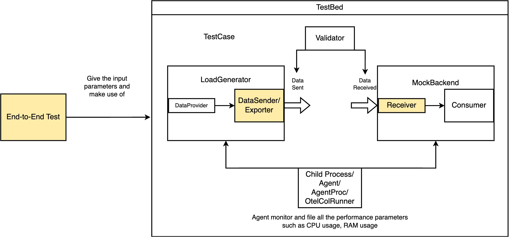

# OpenTelemetry Collector Testbed

Testbed is a controlled environment and tools for conducting end-to-end tests for the Otel Collector,
including reproducible short-term benchmarks, correctness tests, long-running stability tests and 
maximum load stress tests.

## Usage

For each type of tests that should have a summary report create a new directory and then a test suite function which utilizes `*testing.M`. This function should delegate all functionality to `testbed.DoTestMain` supplying a global instance of `testbed.TestResultsSummary` to it.

Each test case within the suite should create a `testbed.TestCase` and supply implementations of each of the various interfaces the `NewTestCase` function takes as parameters.

## DataFlow

`testbed.TestCase` uses `LoadGenerator` and `MockBackend` to further encapsulate pluggable components. `LoadGenerator`'s reference implementation `ProviderSender`, created via `testbed.NewLoadGenerator()` further encapsulates `DataProvider` and `DataSender` in order to generate and send data. Any type satisfying the `LoadGenerator` interface can be used with `testbed.NewLoadGeneratorTestCase()` to exercise functionality beyond the single component limitation of `ProviderSender`. `MockBackend` further encapsulates `DataReceiver` and provides consume functionality.

For instance, if using the existing end-to-end test, the general dataflow can be (Note that MockBackend does not really have a consumer instance, only to make it intuitive, this diagram draws it a separate module):



## Pluggable Test Components

* `DataProvider` - Generates test data to send to receiver under test.
  * `PerfTestDataProvider` - Implementation of the `DataProvider` for use in performance tests. Tracing IDs are based on the incremented batch and data items counters.
  * `GoldenDataProvider` - Implementation of `DataProvider` for use in correctness tests. Provides data from the "Golden" dataset generated using pairwise combinatorial testing techniques.
* `DataSender` - Sends data to the collector instance under test.
  * `JaegerGRPCDataSender` - Implementation of `DataSender` which sends to `jaeger` receiver.
  * `OCTraceDataSender` - Implementation of `DataSender` which sends to `opencensus` receiver.
  * `OCMetricsDataSender` - Implementation of `DataSender` which sends to `opencensus` receiver.
  * `OTLPTraceDataSender` - Implementation of `DataSender` which sends to `otlp` receiver.
  * `OTLPMetricsDataSender` - Implementation of `DataSender` which sends to `otlp` receiver.
  * `ZipkinDataSender` - Implementation of `DataSender` which sends to `zipkin` receiver.
* `DataReceiver` - Receives data from the collector instance under test and stores it for use in test assertions.
  * `OCDataReceiver` - Implementation of `DataReceiver` which receives data from `opencensus` exporter.
  * `JaegerDataReceiver` - Implementation of `DataReceiver` which receives data from `jaeger` exporter.
  * `OTLPDataReceiver` - Implementation of `DataReceiver` which receives data from `otlp` exporter.
  * `ZipkinDataReceiver` - Implementation of `DataReceiver` which receives data from `zipkin` exporter.
* `OtelcolRunner` - Configures, starts and stops one or more instances of otelcol which will be the subject of testing being executed.
  * `ChildProcess` - Implementation of `OtelcolRunner` runs a single otelcol as a child process on the same machine as the test executor.
  * `InProcessCollector` - Implementation of `OtelcolRunner` runs a single otelcol as a go routine within the same process as the test executor.
* `TestCaseValidator` - Validates and reports on test results.
  * `PerfTestValidator` - Implementation of `TestCaseValidator` for test suites using `PerformanceResults` for summarizing results.
  * `CorrectnessTestValidator` - Implementation of `TestCaseValidator` for test suites using `CorrectnessResults` for summarizing results.
* `TestResultsSummary` - Records itemized test case results plus a summary of one category of testing.
  * `PerformanceResults` - Implementation of `TestResultsSummary` with fields suitable for reporting performance test results.
  * `CorrectnessResults` - Implementation of `TestResultsSummary` with fields suitable for reporting data translation correctness test results.

## Adding New Receiver and/or Exporters to the testbed

Generally, when designing a test for new exporter and receiver components, developers should mainly focus on designing and implementing the components with yellow background in the diagram above as the other components are implemented by the testbed framework:

* `DataSender` - This part should provide below interfaces for testing purpose:

  * `Start()` - Start sender and connect to the configured endpoint. Must be called before sending data.
  * `Flush()` - Send any accumulated data.
  * `GetCollectorPort()` - Return the port to which this sender will send data.
  * `GenConfigYAMLStr()` - Generate a config string to place in receiver part of collector config so that it can receive data from this sender.
  * `ProtocolName()` - Return protocol name to use in collector config pipeline.

* `DataReceiver` - This part should provide below interfaces for testing purpose:

  * `Start()` - Start receiver.
  * `Stop()` - Stop receiver.
  * `GenConfigYAMLStr()` - Generate a config string to place in exporter part of collector config so that it can send data to this receiver.
  * `ProtocolName()` - Return protocol name to use in collector config pipeline.

* `Testing` - This part may vary from what kind of testing developers would like to do. In existing implementation, we can refer to [End-to-End testing](https://github.com/open-telemetry/opentelemetry-collector-contrib/blob/main/testbed/tests/e2e_test.go), [Metrics testing](https://github.com/open-telemetry/opentelemetry-collector-contrib/blob/main/testbed/tests/metric_test.go), [Traces testing](https://github.com/open-telemetry/opentelemetry-collector-contrib/blob/main/testbed/tests/trace_test.go), [Correctness Traces testing](https://github.com/open-telemetry/opentelemetry-collector-contrib/blob/main/testbed/correctnesstests/traces/correctness_test.go), and [Correctness Metrics testing](https://github.com/open-telemetry/opentelemetry-collector-contrib/blob/main/testbed/correctnesstests/metrics/metrics_correctness_test.go). For instance, if developers would like to design a trace test for a new exporter and receiver:

  * ```go
    func TestTrace10kSPS(t *testing.T) {
    	tests := []struct {
    		name         string
    		sender       testbed.DataSender
    		receiver     testbed.DataReceiver
    		resourceSpec testbed.ResourceSpec
    	}{
    		{
    			"NewExporterOrReceiver",
    			testbed.NewXXXDataSender(testbed.DefaultHost, testutil.GetAvailablePort(t)),
    			testbed.NewXXXDataReceiver(testutil.GetAvailablePort(t)),
    			testbed.ResourceSpec{
    				ExpectedMaxCPU: XX,
    				ExpectedMaxRAM: XX,
    			},
    		},
    		...
    	}
    	processors := []ProcessorNameAndConfigBody{
    		{
    			Name: "batch",
    			Body: `
	  batch:
    `,
			},
    	}
    	for _, test := range tests {
    		t.Run(test.name, func(t *testing.T) {
    			Scenario10kItemsPerSecond(
    				t,
    				test.sender,
    				test.receiver,
    				test.resourceSpec,
    				performanceResultsSummary,
    				processors,
    			)
    		})
    	}
    }
    ```

## Running the tests

To run the tests, use the `e2e-test` Makefile target, which will compile the Collector and run the end-to-end test suites against it.

### Run all tests

Run the following at the root of the repo:

```
  make e2e-test
```

### Run a particular test suite

Run the following at the root of the repo:

```
  TESTS_DIR=correctnesstests/metrics make e2e-test
```

### Advanced usage

A Makefile is also located at [`testbed/Makefile`](./Makefile) that offers targets to directly run certain test suites. Note that these targets will not compile the Collector before running.

